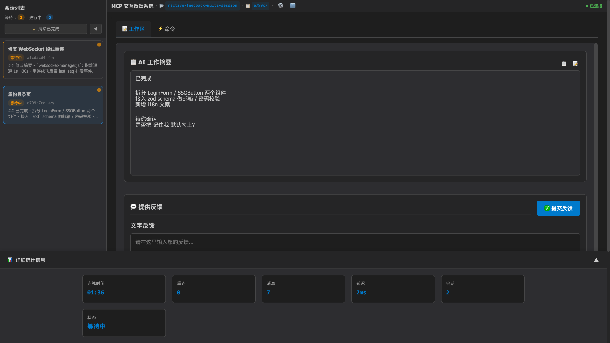
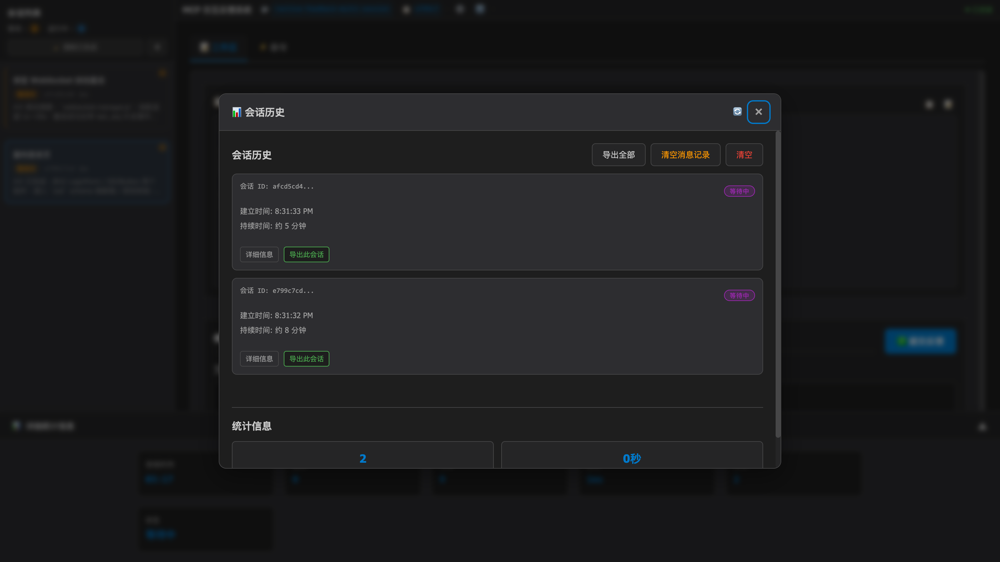

# MCP Feedback Enhanced — HTTP Daemon / Multi-session fork

**🌐 Language / 語言切換:** **English** | [繁體中文](README.zh-TW.md) | [简体中文](README.zh-CN.md)

> **This is a personal fork, not the upstream project.**
> It is derived from [Minidoracat/mcp-feedback-enhanced](https://github.com/Minidoracat/mcp-feedback-enhanced) (which is itself a fork of [Fábio Ferreira's interactive-feedback-mcp](https://github.com/fabioferreira/interactive-feedback-mcp); UI inspired by [sanshao85/mcp-feedback-collector](https://github.com/sanshao85/mcp-feedback-collector)).
>
> I ([@0xlane](https://github.com/0xlane)) rewrote the transport layer into an **HTTP daemon + single-instance multi-session + 3-layer UI** purely for my own use. The version number starts at **v3.0.0** only because the breaking change requires one — **it does NOT claim to be the successor to upstream v2.x**, and I am **not the original author** of any of the v2.x features. All the ideas and heavy lifting from v2.x belong to Minidoracat and the upstream contributors; this fork just reshapes how those pieces are wired together.

## 🎯 Core Concept

This is an [MCP server](https://modelcontextprotocol.io/) that establishes
**feedback-oriented development workflows**. Instead of letting AI take
speculative actions, it pauses the agent and lets the human confirm — collapsing
what would otherwise be many round-trips into a single, higher-quality feedback
request. v3.0 reshapes the architecture into a **single HTTP daemon + one
browser tab that aggregates every concurrent AI session**:

- 🔌 **Single daemon, HTTP transport**: every AI agent on your machine talks to
  the same `127.0.0.1:8765` daemon over Streamable HTTP — no more per-agent
  stdio subprocess, no more port sprawl.
- 🗂️ **True multi-session**: each `interactive_feedback` call registers its own
  session; nothing gets overwritten when parallel Cursor chats call the tool
  at the same time.
- 🪟 **One browser tab for everything**: every concurrent session shows up in
  a single Web UI; switch with a click or `Cmd/Ctrl+1..9`.
- 🌐 **Works over SSH Remote / WSL**: UI is plain web, no GUI toolkit needed.

**Supported Platforms:** [Cursor](https://www.cursor.com) | [Cline](https://cline.bot) | [Windsurf](https://windsurf.com) | [Augment](https://www.augmentcode.com) | [Trae](https://www.trae.ai)

### 🔄 Workflow
1. **Daemon once** → `uv run mcp-interactive-feedback serve --http` from the cloned repo (background, keeps running)
2. **Agent calls** → `interactive_feedback` over HTTP to the daemon
3. **Session registered** → the daemon inserts a new session and pushes it over WebSocket
4. **UI notifies, doesn't steal focus** → sidebar red dot + `(N)` title prefix + OS notification
5. **Human replies** → text, images, commands; submit with `Cmd/Ctrl+Enter`
6. **Agent continues** → response delivered over HTTP, session marked complete

## 🌟 Key Features

### 🔌 Single-daemon Multi-session Architecture (v3.0)
- **One HTTP daemon** on `127.0.0.1:8765` serves every AI agent on your machine — no more per-chat stdio subprocess
- **Parallel sessions coexist**: concurrent Cursor chats no longer overwrite each other mid-call
- **Sticky active pointer**: new sessions notify without stealing your current view
- **WebSocket multiplexing**: a single `/ws` connection routes events for every session by `session_id`
- **Per-session drafts**: switching sessions never loses your in-flight text input
- **Archive = physical delete**: browser refresh can't resurrect closed sessions

### 🪟 3-layer UI
- **Topbar**: app-wide `⚙️ Settings` / `ℹ️ About` → modals (never tangled with session tabs)
- **Left sidebar**: live session list, pending red dots, `📊 Session History` modal at the bottom
- **Right pane tabs**: strictly session-level work — `📝 Workspace` / `📋 AI Summary` / `⚡ Command`
- **Quick switch**: click a session card, or use `Cmd/Ctrl+1..9`
- **Four-layer pending notification**: sidebar red dot · `(N)` title prefix · favicon badge · OS desktop notification

### 📝 Smart Workflow
- **Prompt Management**: CRUD, usage stats, intelligent ordering
- **Auto-Timed Submit**: 1–86400s timer, pause / resume / cancel
- **Auto Command Execution**: run preset commands after session create / submit
- **Session Management & Tracking**: local-file history, export (JSON / CSV / Markdown), live stats, flexible timeouts
- **Connection Monitoring**: WebSocket status, auto-reconnect, quality indicator
- **Markdown Rendering** in AI summaries: headings, bold, code blocks, lists, links

### 🎨 Modern Experience
- **Responsive, modular JS** architecture
- **Audio + system notifications**: built-in sounds, custom upload, OS-level alerts for auto-commit / timeout
- **Smart Memory**: input height memory, one-click copy, persistent per-user settings
- **Multi-language**: Traditional Chinese, English, Simplified Chinese — instant switching

### 🖼️ Images & Media
- **Full Format Support**: PNG, JPG, JPEG, GIF, BMP, WebP
- **Convenient Upload**: Drag & drop files, clipboard paste (Ctrl+V)
- **Unlimited Processing**: Support for any size images, automatic intelligent processing

## 🌐 Interface Preview

<div align="center">
  
</div>

*v3.0 Web UI with two parallel sessions coming from two AI agents. The **topbar**
hosts app-wide actions (⚙️ Settings / ℹ️ About); the **left sidebar** lists
live sessions (active one is highlighted) and has a `📊 Session History`
button pinned at the bottom; the **right pane** exposes only **session-level**
tabs (`📝 Workspace` / `⚡ Command`, with AI Summary embedded in Workspace).
The connection monitor at the bottom is expanded, showing uptime, reconnects,
message count, latency, session count and current session status.*

<details>
<summary>📱 Click to view the Session History modal (cross-session, app-level)</summary>

<div align="center">
  
</div>

*Opening `📊 Session History` from the bottom of the sidebar dims the
rest of the UI and shows an app-level modal with today's sessions, average
duration, export/clear actions. Modals like this (Session History / Settings /
About) live in the **app-wide** layer so they do not pollute per-session
tabs.*

</details>

> Tauri desktop shell is **paused in v3.0** and not shipped by CI. Sources
> remain in `src-tauri/` for reference. See the Acknowledgments section.

**Shortcut Support**
- `Cmd/Ctrl+1..9`: jump to the N-th session in the sidebar
- `Ctrl+Enter` (Windows/Linux) / `Cmd+Enter` (macOS): submit feedback (main keyboard and numeric keypad both work)
- `Ctrl+V` / `Cmd+V`: paste clipboard images directly
- `Ctrl+I` / `Cmd+I`: quick-focus the input box (thanks @penn201500)

## 🚀 Quick Start (v3.0)

> **v3.0 breaking change** — the stdio transport is gone. Every AI agent on this
> machine now talks to a **single long-running HTTP daemon** on
> `http://127.0.0.1:8765/mcp/`. You start the daemon once and open a single
> browser tab for all sessions.
>
> Upgrading from v2.x? Your old `mcp.json` with `"command": "uvx", "args": [...]`
> will no longer work — see **Step 2** below for the new HTTP-style entry.

### 1. Clone the repo and launch the daemon

> This fork is **not published to PyPI** — I only use it locally and don't
> want to be on the hook for a public release. Install from source with
> [`uv`](https://docs.astral.sh/uv/):

```bash
# Install uv if needed
pip install uv

# Clone this fork
git clone https://github.com/0xlane/mcp-interactive-feedback-multi-session.git
cd mcp-interactive-feedback-multi-session

# Install deps (creates .venv automatically)
uv sync

# Start the daemon (foreground; Ctrl+C to stop)
uv run mcp-interactive-feedback serve --http
```

The daemon binds `127.0.0.1:8765` by default and refuses to start a second
instance (it uses a PID lock at `~/.config/mcp-feedback-enhanced/daemon.pid`).
Run it as a background service any way you like (`tmux` / `launchd` / `systemd`
/ `nohup`). See all flags:

| Flag | Default | Notes |
|---|---|---|
| `--host` | `127.0.0.1` | Keep default for local use — no auth is enforced |
| `--port` | `8765` | Port-in-use is a hard error; we do **not** auto-increment |
| `--log-level` | `info` | uvicorn log level |
| `--pid-file` | `~/.config/mcp-feedback-enhanced/daemon.pid` | Override if you need to isolate per-user state |

> Prefer not to prefix every command with `uv run`? `uv sync` creates a
> `.venv/`; `source .venv/bin/activate` once, then you can run
> `mcp-interactive-feedback serve --http` directly. Or, if you want a global
> shim, install the checkout as a uv tool: `uv tool install --from . mcp-interactive-feedback`.

### 2. Point `mcp.json` at the daemon

`~/.cursor/mcp.json` (or `<project>/.cursor/mcp.json`):

```json
{
  "mcpServers": {
    "mcp-feedback-enhanced": {
      "url": "http://127.0.0.1:8765/mcp/",
      "autoApprove": ["interactive_feedback"]
    }
  }
}
```

- The trailing `/` on `/mcp/` is required (Streamable HTTP endpoint).
- No `command` / `args` / `env` needed — the agent speaks HTTP directly.
- The per-call `timeout` field has no effect in HTTP transport (MCP handles it).

### 3. Open the Web UI once

```
http://127.0.0.1:8765/
```

The UI is laid out as a **3-layer information architecture** so global app
actions never get mixed up with session-level work:

| Layer | Where | What lives there |
|---|---|---|
| **App-wide** | Topbar (top-right) | `⚙️ Settings` / `ℹ️ About` icon buttons → modals |
| **Cross-session** | Left sidebar | Live session list + `📊 Session History` button at the bottom → modal |
| **Current session** | Right pane tabs | `📝 Workspace` / `📋 AI Summary` / `⚡ Command` |

Every concurrent AI chat that calls `interactive_feedback` shows up as a new
card in the left sidebar. Switch with a click or `Cmd/Ctrl+1..9`. New sessions
arrive **without stealing your current view** — you only get a red dot on the
sidebar card, an `(N)` prefix on the browser title, and an OS-level notification.

See [docs/architecture/phase3-multi-session-ui-usage.md](docs/architecture/phase3-multi-session-ui-usage.md)
for every shortcut, the per-session draft behavior, and archiving semantics.

### 4. Prompt Engineering Setup

For optimal results, add this rule to your AI assistant:

```
# MCP Interactive Feedback Rules

follow mcp-feedback-enhanced instructions
```

## ⚙️ Advanced Settings

### CLI flags (preferred in v3.0)

In daemon mode, **`--host` / `--port` are CLI flags**; the legacy
`MCP_WEB_HOST` / `MCP_WEB_PORT` env vars are intentionally ignored by
`serve --http` so a single daemon's binding is unambiguous.

```bash
uv run mcp-interactive-feedback serve --http \
    --host 127.0.0.1 --port 8765 --log-level info
```

### Environment Variables

| Variable | Purpose | Values | Default |
|----------|---------|--------|---------|
| `MCP_DEBUG` | Verbose debug logging | `true`/`false` | `false` |
| `MCP_LANGUAGE` | Force UI language | `zh-TW` / `zh-CN` / `en` | Auto-detect |

`MCP_LANGUAGE` detection priority:
1. User-saved language in the UI (highest)
2. `MCP_LANGUAGE`
3. OS env (`LANG`, `LC_ALL`, …)
4. OS default language
5. Fallback: Traditional Chinese

> Removed in v3.0: `MCP_WEB_HOST`, `MCP_WEB_PORT`, `MCP_DESKTOP_MODE` no longer
> apply to `serve --http` (host/port come from CLI flags; the Tauri desktop
> mode is paused — see the Acknowledgments / project history for context).

### Testing Options

All commands run from inside the cloned repo (`uv sync` done first):

```bash
# Version check
uv run mcp-interactive-feedback version

# One-shot Web UI test (auto-launches browser, keeps running)
uv run mcp-interactive-feedback test --web

# Debug mode
MCP_DEBUG=true uv run mcp-interactive-feedback test --web

# Force a specific UI language
MCP_LANGUAGE=en    uv run mcp-interactive-feedback test --web
MCP_LANGUAGE=zh-TW uv run mcp-interactive-feedback test --web
MCP_LANGUAGE=zh-CN uv run mcp-interactive-feedback test --web
```

### Developer workflow

Since this fork only supports running from source, the developer setup and the
user setup are the same:

```bash
git clone https://github.com/0xlane/mcp-interactive-feedback-multi-session.git
cd mcp-interactive-feedback-multi-session
uv sync
```

**Local Testing Methods**
```bash
# Launch the daemon from the local source checkout
uv run python -m mcp_feedback_enhanced serve --http
# equivalent:
uv run mcp-interactive-feedback serve --http

# Or run the test harness (spins up the Web UI and keeps it running)
uv run python -m mcp_feedback_enhanced test --web

# Unit + integration tests
make test            # all tests (202 passing)
make test-fast       # skip slow ones
make test-cov        # generate htmlcov/ coverage report

# Code quality
make check           # full lint + format + type check
make quick-check     # quick auto-fix pass
```

> Tauri desktop build targets (`make build-desktop*` / `test-desktop*`) were
> retired in v3.0 — the desktop app is paused; see the project history. The
> Rust/Tauri sources are kept in `src-tauri/` for reference only.

**Testing Descriptions**
- **Functional Testing**: Test complete MCP tool functionality workflow
- **Unit Testing**: Test individual module functionality
- **Coverage Testing**: Generate HTML coverage report to `htmlcov/` directory
- **Quality Checks**: Include linting, formatting, type checking

## 🆕 Version History

📋 **Complete Version History:** [RELEASE_NOTES/CHANGELOG.en.md](RELEASE_NOTES/CHANGELOG.en.md)

> **Scope note** — Everything **v2.6.x and earlier** belongs to the upstream
> project ([Minidoracat/mcp-feedback-enhanced](https://github.com/Minidoracat/mcp-feedback-enhanced));
> those changelog entries are preserved under `RELEASE_NOTES/` only so the
> provenance chain stays visible. I am **not** the author of those releases.
> This fork's own history starts at **v3.0.0**, and is limited to the HTTP
> daemon / multi-session / 3-layer UI redesign described below.

### Latest Version Highlights (v3.0.0)
- 🔌 **HTTP transport, single daemon**: stdio is gone; one long-running daemon on `127.0.0.1:8765` serves every AI agent on the machine.
- 🗂️ **Real multi-session**: sessions are inserted (not replaced). All concurrent `interactive_feedback` calls coexist in one browser tab.
- 👁️ **Sticky active pointer**: a new session will not steal your current view — notification only via sidebar red dot + `(N)` title prefix + OS notification.
- 🪟 **3-layer UI architecture**: topbar for app-wide actions, left sidebar for session list + history modal, right pane tabs only for session-level work.
- ⌨️ **Per-session draft + `Cmd/Ctrl+1..9`**: switching sessions never loses your in-flight text input; numeric shortcuts jump to a specific session.
- 🗑️ **Archive = physical delete**: closing a session actually removes it from the backend, so a browser refresh cannot resurrect old sessions.
- ⚠️ **Breaking change vs. v2.x**: every `mcp.json` entry must be migrated from `command/args` to `"url": "http://127.0.0.1:8765/mcp/"`.

## 🐛 Common Issues

### 🌐 SSH Remote Environment Issues
**Q: Browser cannot launch or access in SSH Remote environment**
A: Two solutions. In v3.0 host/port live on the daemon CLI, not in `mcp.json`.

**Solution 1: Bind the daemon to `0.0.0.0` (recommended)**
Start the daemon on the remote host so it listens on all interfaces:
```bash
cd /path/to/mcp-interactive-feedback-multi-session
uv run mcp-interactive-feedback serve --http --host 0.0.0.0 --port 8765
```
Your agent's `mcp.json` stays the same on the remote host:
```json
{
  "mcpServers": {
    "mcp-feedback-enhanced": {
      "url": "http://127.0.0.1:8765/mcp/",
      "autoApprove": ["interactive_feedback"]
    }
  }
}
```
Open in your local browser: `http://<remote-host-ip>:8765`.

**Solution 2: SSH port forwarding (traditional)**
1. Keep the daemon on its default `127.0.0.1:8765`.
2. Forward the port from your machine:
   - **VS Code Remote SSH**: `Ctrl+Shift+P` → "Forward a Port" → enter `8765`
   - **Cursor SSH Remote**: add a port-forwarding rule manually for `8765`
3. Open `http://localhost:8765` locally.

For more, see the [SSH Remote Environment Usage Guide](docs/en/ssh-remote/browser-launch-issues.md).

**Q: Why am I not receiving new MCP feedback?**
A: Likely a WebSocket connection issue. **Solution**: Directly refresh the browser page.

**Q: Why isn't MCP being called?**
A: Please confirm MCP tool status shows green light. **Solution**: Repeatedly toggle MCP tool on/off, wait a few seconds for system reconnection.

**Q: Augment cannot start MCP**
A: **Solution**: Completely close and restart VS Code or Cursor, reopen the project.

### 🔧 General Issues

**Q: Can I still use the desktop application?**
A: The Tauri desktop shell is **paused in v3.0**. The `src-tauri/` sources are kept for reference but no longer built by CI, and `MCP_DESKTOP_MODE` has no effect in the HTTP daemon. If you specifically need a native shell, stay on the upstream [Minidoracat/mcp-feedback-enhanced](https://github.com/Minidoracat/mcp-feedback-enhanced) `v2.6.x` release line — those versions still ship Tauri binaries but are single-session stdio only.

**Q: My old `"command": "uvx", "args": [...]` mcp.json stopped working**
A: That's the v2.x stdio-style config. v3.0 dropped stdio entirely. Migrate to:

```json
{ "mcpServers": { "mcp-feedback-enhanced": { "url": "http://127.0.0.1:8765/mcp/", "autoApprove": ["interactive_feedback"] } } }
```

And start the daemon once from your local checkout: `uv run mcp-interactive-feedback serve --http`.

**Q: Daemon refuses to start — `daemon already running`**
A: Another instance holds the PID lock at `~/.config/mcp-feedback-enhanced/daemon.pid`. If `lsof -i :8765` shows no listener, the PID file is stale — delete it and retry. Port conflict on `8765`? Pass `--port <other>` and update `mcp.json` accordingly.

**Q: "Unexpected token 'D'" error appears**
A: Debug output is bleeding into the MCP protocol stream. Set `MCP_DEBUG=false` or remove the env var.

**Q: Image upload failure**
A: Check file format (PNG / JPG / JPEG / GIF / BMP / WebP). Any size is supported.

**Q: Web UI refuses to load / not reachable**
A: Check whether a firewall is blocking the daemon port (default `8765`), or swap the port with `--port <other>` and update the `url` in `mcp.json` accordingly.

**Q: UV Cache occupies too much disk space**
A: Due to frequent use of `uvx` commands, cache may accumulate to tens of GB. Regular cleanup recommended:
```bash
# View cache size and detailed information
python scripts/cleanup_cache.py --size

# Preview cleanup content (no actual cleanup)
python scripts/cleanup_cache.py --dry-run

# Execute standard cleanup
python scripts/cleanup_cache.py --clean

# Force cleanup (attempts to close related programs, solving Windows file occupation issues)
python scripts/cleanup_cache.py --force

# Or directly use uv command
uv cache clean
```
For detailed instructions, refer to: [Cache Management Guide](docs/en/cache-management.md)

**Q: AI models cannot parse images**
A: Various AI models (including Gemini Pro 2.5, Claude, etc.) may have instability in image parsing, sometimes correctly recognizing and sometimes unable to parse uploaded image content. This is a known limitation of AI visual understanding technology. Recommendations:
1. Ensure good image quality (high contrast, clear text)
2. Try uploading multiple times, retries usually succeed
3. If parsing continues to fail, try adjusting image size or format

## 🙏 Acknowledgments

This fork stands on the shoulders of giants. I only reshaped the transport and
UI — virtually everything else was built by the upstream authors listed below:

- [**Fábio Ferreira**](https://github.com/fabioferreira) — author of the original **interactive-feedback-mcp**
- [**Minidoracat**](https://github.com/Minidoracat) — author of **mcp-feedback-enhanced**, the direct upstream of this fork (everything at v2.6.x and earlier is their work)
- [**sanshao85**](https://github.com/sanshao85) — UI design inspiration from **mcp-feedback-collector**
- Upstream contributors: **penn201500**, **leo108**, **Alsan**, **fireinice**

If this tool helps you, please also consider starring / sponsoring the upstream
projects — that is where the heavy lifting lives.

### Community Support
- **Issues:** [GitHub Issues](https://github.com/0xlane/mcp-interactive-feedback-multi-session/issues)

## 📄 License

MIT License - See [LICENSE](LICENSE) file for details

## 📈 Star History

[](https://star-history.com/#0xlane/mcp-interactive-feedback-multi-session&Date)

---
**🌟 Welcome to Star and share with more developers!**
