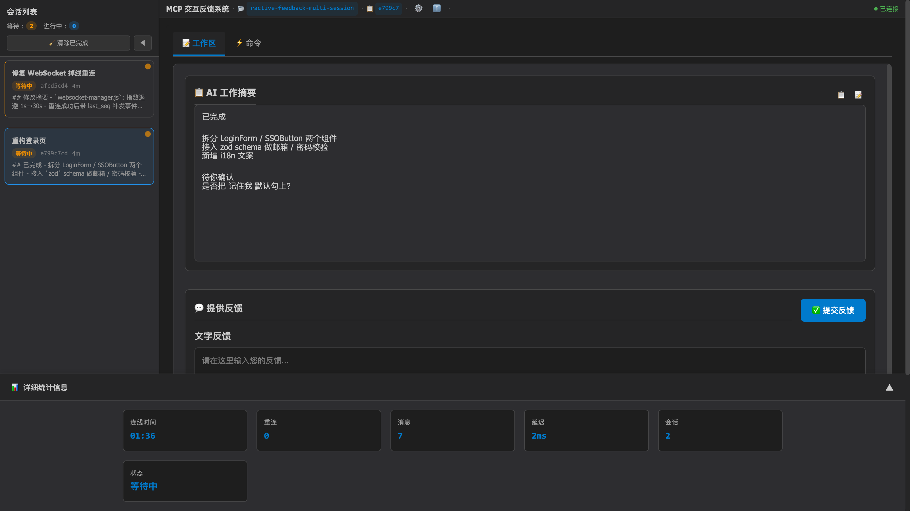
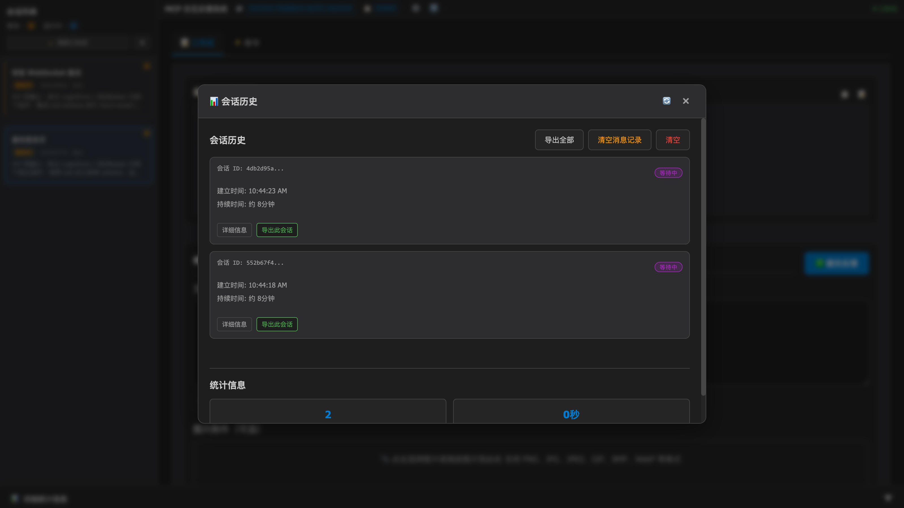

# MCP Feedback Enhanced — HTTP Daemon / 多会话分支

**🌐 语言切换 / Language:** [English](README.md) | [繁體中文](README.zh-TW.md) | **简体中文**

> **这是个人 fork，不是上游项目。**
> 基于 [Minidoracat/mcp-feedback-enhanced](https://github.com/Minidoracat/mcp-feedback-enhanced)（该项目又 fork 自 [Fábio Ferreira 的 interactive-feedback-mcp](https://github.com/fabioferreira/interactive-feedback-mcp)，UI 参考自 [sanshao85/mcp-feedback-collector](https://github.com/sanshao85/mcp-feedback-collector)）。
>
> 我（[@0xlane](https://github.com/0xlane)）把传输层重写为 **HTTP daemon + 单实例多会话 + 3 层 UI**，纯属自用改造。本仓库版本号从 **v3.0.0** 起步只是因为引入了 breaking change，**不代表承接上游 v2.x 的路线**，我也**不是任何 v2.x 功能的原作者**。v2.x 时代的所有能力都归功于 Minidoracat 与上游贡献者，本 fork 只是把这些零件重新焊接了一下。

## 🎯 核心概念

这是一个 [MCP 服务器](https://modelcontextprotocol.io/)，为 AI Agent 提供
**反馈导向的开发工作流程**。它用一个常驻 HTTP daemon 汇聚同机上**所有** AI
Agent 的 `interactive_feedback` 调用，把它们统一呈现在**同一个浏览器 Tab**
里，彻底解决 v2.x 中"每 Agent 一个 stdio 实例 / 每次反馈一个新浏览器窗口"
导致的并发冲突。

通过引导 AI 与用户确认、而非推测性操作，可将多次工具调用合并为一次以反馈
为导向的请求，节省平台成本、改善开发效率。

**🔑 v3.0 架构关键：**

- 🌐 **常驻 HTTP daemon**：一台机器只跑一个 `mcp-interactive-feedback` 进程
  （PID 锁保护），所有 Cursor / Cline / Windsurf / Augment 通过
  `http://127.0.0.1:8765/mcp/` 复用它。
- 🪢 **真正的多会话**：多个 AI 调用并发送来时，后端同时保留每个会话，前端
  在左侧栏列出，用户可随意切换。
- 📑 **单浏览器 Tab**：不会再弹出新窗口 —— 第一次由 daemon 带起 Tab，之后
  所有新会话复用它，并通过标题 `(N)` + 系统通知提醒。
- 🛰️ **SSH / WSL 友好**：只要能访问到 daemon 的 HTTP 端口就能工作，不再受
  GUI 依赖限制。桌面外壳（Tauri）在 v3.0 **暂停开发**。

**支持平台：**
[Cursor](https://www.cursor.com) | [Cline](https://cline.bot)
| [Windsurf](https://windsurf.com) | [Augment](https://www.augmentcode.com)
| [Trae](https://www.trae.ai)

### 🔄 工作流程

1. **启动 daemon**（一次）：在克隆好的仓库里跑
   `uv run mcp-interactive-feedback serve --http`，默认监听 `127.0.0.1:8765`。
2. **AI 调用** `interactive_feedback` → daemon 创建一个新的 `WebFeedbackSession`。
3. **UI 汇聚**：同一个浏览器 Tab 通过 WebSocket 收到广播；侧栏增量追加卡片，
   **不会**抢走你当前查看的会话。
4. **通知**：侧栏红点 + 浏览器 Tab 标题 `(N)` 前缀 + 可选系统通知。
5. **用户回复**：打字、粘图、挑命令、提交。草稿在会话间自动保存。
6. **返回 AI**：反馈回传给对应 Agent；会话归档即从内存中物理删除。
7. **AI 继续**：根据反馈调整行为或结束任务。

## 🌟 主要功能

### 🪢 单 daemon · 多会话架构（v3.0）

- **HTTP transport**：FastMCP 在 `/mcp/` 下运行 Streamable HTTP 端点，IDE
  通过 MCP 协议直连。
- **并发会话**：`WebUIManager` 对每个 `interactive_feedback` 调用 new 一个
  `WebFeedbackSession`，并发不受限制。
- **Sticky active pointer**：`_active_session_id` 只响应用户显式切换，
  新来会话**不抢视图**。
- **WebSocket 多路复用**：一条客户端 WebSocket 承载所有会话事件，断线后
  重连会补齐 session list。
- **Per-session 草稿**：每个 `SessionDataManager` 记住每会话的文字 / 图片 /
  命令 / 超时设置。
- **归档 = 物理删除**：会话完成或手动归档都会立即从内存清理，侧栏不保留
  灰色卡片。

### 🏛️ 3 层 UI（v3.0）

- **顶栏（应用级）**：`⚙️ 设置` / `ℹ️ 关于` 以模态窗口形式打开，切换会话
  不会丢失它们的状态。
- **左侧栏（跨会话）**：实时会话卡片列表 —— 浅色 badge、缩略时间、等待中
  会话红点。底部的 `🗂️ 会话历史` 按钮打开全局历史模态。
- **右栏（会话级 Tab）**：`📝 工作区`（AI 摘要嵌入其中）/ `⚡ 命令` —— 只放
  当前会话的数据，和全局动作物理分开。
- **快速切换**：`Cmd/Ctrl+1..9` 跳到对应顺序的会话；`Cmd/Ctrl+Enter` 提交。
- **四层提醒**：侧栏 dot、Tab 标题 `(N)`、可选系统通知、WebSocket 事件 —
  无论你是否聚焦，都不会错过待办。

### 📝 智能工作流程

- **提示词管理**：常用提示词 CRUD、使用统计、智能排序。
- **自动定时提交**：1–86400 秒弹性计时器，支持暂停 / 恢复 / 取消。
- **自动执行命令**：新建会话 / 提交后可自动执行预设命令。
- **会话管理追踪**：本地文件存储、历史模态中导出为 JSON / CSV / Markdown。
- **连接监控**：右上角「● 已连接」指示器悬停时显示连接时长、重连次数、消息
  计数、延迟、会话数等诊断信息，独立 tick，不依赖 WebSocket 心跳。
- **AI 摘要 Markdown 渲染**：支持标题、代码块、列表、链接等常见元素。

### 🎨 现代化体验

- **响应式布局**：支持不同屏幕尺寸，JS 模块化。
- **音效 + 系统通知**：内建提示音并可自定义；系统级通知提醒远端事件。
- **智能记忆**：输入框高度、活跃 Tab、语言偏好持久化。
- **多语言**：简体中文、英文、繁体中文，即时切换。

### 🖼️ 图片与媒体

- **全格式支持**：PNG / JPG / JPEG / GIF / BMP / WebP。
- **便捷上传**：拖拽、剪贴板粘贴（`Cmd/Ctrl+V`）。
- **不限大小**：自动处理。

## 🌐 界面预览

### Web UI（v3.0 · 3 层信息架构）

<div align="center">
  
</div>

*v3.0 Web UI —— 两个并行会话同时汇聚到同一个浏览器 Tab。顶部 **顶栏** 放应用级动作
（⚙️ 设置 / ℹ️ 关于）；**左侧栏** 列出所有活动会话（当前会话高亮），底部固定一个
`🗂️ 会话历史` 按钮；**右栏** 以 Tab 形式只展示**会话级**工作项（`📝 工作区` / `⚡ 命令`，
AI 摘要嵌在工作区里）。悬停右上角的 `● 已连接` 指示器可以看到连线时间 / 重连次数 /
消息数 / 延迟 / 会话数等诊断信息。*

<details>
<summary>📱 点击查看「会话历史」模态（跨会话 · 应用级）</summary>

<div align="center">
  
</div>

*从侧栏底部点 `🗂️ 会话历史` 会打开一个应用级模态，遮罩掉会话视图，展示当日
会话数、平均时长、导出 / 清空 操作。「会话历史 / 设置 / 关于」都属于**应用级**，
放在全局模态里，不会污染每个会话自己的 Tab。*

</details>

> 桌面外壳（Tauri）在 v3.0 **已暂停**。v3 所有功能均通过浏览器访问
> daemon 完成。计划恢复时会在这里同步更新。

**快捷键支持**

- `Ctrl+Enter`（Windows/Linux）/ `Cmd+Enter`（macOS）：提交反馈（主键盘与数字键盘皆支持）
- `Ctrl+V`（Windows/Linux）/ `Cmd+V`（macOS）：直接粘贴剪贴板图片
- `Ctrl+I`（Windows/Linux）/ `Cmd+I`（macOS）：快速聚焦输入框 （感谢 @penn201500）
- `Cmd/Ctrl+1..9`：切换到侧栏中对应位置的会话

## 🚀 快速开始（v3.0）

> **v3.0 破坏性变更** —— 完全移除了 stdio 传输。本机所有 AI Agent 现在都走
> **同一个常驻 HTTP daemon**（`http://127.0.0.1:8765/mcp/`）。你只启动一次
> daemon，所有会话汇聚在同一个浏览器 Tab 里。
>
> 从 v2.x 升级？旧版 `mcp.json` 里 `"command": "uvx", "args": [...]` 的写法
> 已不再工作，请按下面 **第 2 步** 改为 HTTP 引用。

### 1. 克隆仓库并启动 daemon

> 这个 fork **没有发布到 PyPI** —— 我只是自己在用、暂时不想维护公开发行。
> 请直接用 [`uv`](https://docs.astral.sh/uv/) 从源码安装：

```bash
# 如果还没装 uv，先装
pip install uv

# 克隆本 fork
git clone https://github.com/0xlane/mcp-interactive-feedback-multi-session.git
cd mcp-interactive-feedback-multi-session

# 装依赖（会自动创建 .venv）
uv sync

# 前台启动 daemon（Ctrl+C 结束）
uv run mcp-interactive-feedback serve --http
```

Daemon 默认绑 `127.0.0.1:8765`，并以 PID 锁
（`~/.config/mcp-feedback-enhanced/daemon.pid`）拒绝第二个实例启动。
想让它后台常驻？用 `tmux` / `launchd` / `systemd` / `nohup` 等任一方式即可。
可选参数：

| 参数 | 默认 | 说明 |
|---|---|---|
| `--host` | `127.0.0.1` | 建议保持默认 —— 本地使用，不做鉴权 |
| `--port` | `8765` | 端口被占用**直接报错**，不自动递增 |
| `--log-level` | `info` | uvicorn 日志级别 |
| `--pid-file` | `~/.config/mcp-feedback-enhanced/daemon.pid` | 多用户/多实例隔离时才需要改 |

> 不想每次敲 `uv run`？`uv sync` 会生成 `.venv/`，
> `source .venv/bin/activate` 一次后就能直接执行 `mcp-interactive-feedback serve --http`。
> 想要全局可用的命令，也可以：`uv tool install --from . mcp-interactive-feedback`。

### 2. 把 `mcp.json` 指向 daemon

`~/.cursor/mcp.json`（或项目级 `<project>/.cursor/mcp.json`）：

```json
{
  "mcpServers": {
    "mcp-feedback-enhanced": {
      "url": "http://127.0.0.1:8765/mcp/",
      "autoApprove": ["interactive_feedback"]
    }
  }
}
```

- `/mcp/` 末尾的 `/` **必须**保留（Streamable HTTP 端点）；
- 不再需要 `command` / `args` / `env` —— AI Agent 直接走 HTTP；
- 单次调用的 `timeout` 字段对 HTTP transport **无效**（由 MCP 协议自身处理）。

### 3. 打开一次 Web UI

```
http://127.0.0.1:8765/
```

UI 按 **3 层信息架构**组织，避免全局动作和会话级工作混在一起：

| 层级 | 位置 | 放什么 |
|---|---|---|
| **应用全局** | 顶栏右上 | `⚙️ 设置` / `ℹ️ 关于` 图标按钮 → 模态 |
| **跨会话** | 左侧边栏 | 实时会话列表 + 底部 `🗂️ 会话历史` 按钮 → 模态 |
| **当前会话** | 右栏 Tab | `📝 工作区`（AI 摘要嵌入其中）/ `⚡ 命令` |

每个并发的 AI 调用 `interactive_feedback` 都会在左侧栏以卡片出现；点击卡片
或 `Cmd/Ctrl+1..9` 即可切换。新会话到来时**不会**抢走你当前的视图 ——
只会通过侧栏红点 + 浏览器标题 `(N)` 前缀 + 系统通知提醒。

详细快捷键、每会话草稿行为、归档语义见
[docs/architecture/phase3-multi-session-ui-usage.md](docs/architecture/phase3-multi-session-ui-usage.md)。

### 4. 设置提示工程

为了获得最佳效果，请在 AI 助手中添加以下规则：

```
# MCP Interactive Feedback 规则

注意在任务完成前根据mcp-feedback-enhanced工具的要求进行工具调用
```

## ⚙️ 高级设置

### CLI 参数（v3.0 推荐）

在 v3.0 中，主机/端口通过 `mcp-interactive-feedback serve --http` 的
**命令行参数**传入 daemon，**不再**通过 `env` 从 Agent 侧注入。

```bash
uv run mcp-interactive-feedback serve --http \
    --host 127.0.0.1 \
    --port 8765 \
    --log-level info
```

完整清单见上面 [🚀 快速开始](#-快速开始v30) 中的参数表。

### 环境变量

只有下列两个环境变量仍由 daemon 读取：

| 变量 | 用途 | 取值 | 默认 |
|------|------|------|------|
| `MCP_DEBUG` | 打开 MCP/服务器调试日志 | `true` / `false` | `false` |
| `MCP_LANGUAGE` | 强制 UI 语言 | `zh-TW` / `zh-CN` / `en` | 自动检测 |

语言检测优先顺序：

1. UI 里保存的语言设置（最高优先级）
2. `MCP_LANGUAGE` 环境变量
3. 系统 locale（`LANG` / `LC_ALL` 等）
4. 默认回退到繁体中文

> `MCP_WEB_HOST` / `MCP_WEB_PORT` / `MCP_DESKTOP_MODE` 已在 v3.0 移除 ——
> host/port 请走 CLI flags，桌面模式已暂停开发。

### 测试选项

在克隆出的仓库里（`uv sync` 跑过一次之后）：

```bash
# 版本
uv run mcp-interactive-feedback --version

# 启动 daemon（前台）
uv run mcp-interactive-feedback serve --http

# 指定语言启动
MCP_LANGUAGE=en    uv run mcp-interactive-feedback serve --http
MCP_LANGUAGE=zh-TW uv run mcp-interactive-feedback serve --http
MCP_LANGUAGE=zh-CN uv run mcp-interactive-feedback serve --http

# 调试输出
MCP_DEBUG=true uv run mcp-interactive-feedback serve --http
```

### 开发者工作流

由于本 fork 只支持源码运行，开发者安装 = 普通用户安装：

```bash
git clone https://github.com/0xlane/mcp-interactive-feedback-multi-session.git
cd mcp-interactive-feedback-multi-session
uv sync
```

**本地测试方式**

```bash
# 从源码启动 daemon（两种等价写法）
uv run python -m mcp_feedback_enhanced serve --http
uv run mcp-interactive-feedback serve --http

# 或跑测试 harness（自动拉起 Web UI 并保持运行）
uv run python -m mcp_feedback_enhanced test --web

# 单元 / 集成测试
make test                # pytest 完整套件
make test-fast           # 跳过慢速用例
make test-cov            # 覆盖率报告到 htmlcov/

# 代码质量
make check               # 完整 lint + format + type-check
make quick-check         # 快速修复
```

> Tauri 桌面构建目标（`build-desktop*` / `test-desktop*`）已随桌面外壳一起
> 在 v3.0 暂停。计划恢复时，会以套壳 HTTP daemon 的方式重新上线。

**测试说明**

- **功能测试**：完整 MCP 工具流程（创建会话 → 回填反馈 → 归档）
- **单元测试**：各模块独立测试
- **覆盖率**：HTML 报告输出到 `htmlcov/`
- **质量检查**：包含 linting / formatting / type-check

## 🆕 版本更新记录

📋 **完整版本更新记录：** [RELEASE_NOTES/CHANGELOG.zh-CN.md](RELEASE_NOTES/CHANGELOG.zh-CN.md)

> **范围说明** —— 所有 **v2.6.x 及之前**的版本都属于上游
> [Minidoracat/mcp-feedback-enhanced](https://github.com/Minidoracat/mcp-feedback-enhanced)，
> 我把那些 changelog 保留在 `RELEASE_NOTES/` 目录仅仅是为了让血统链可查；
> 我**并不是**那些发行版的作者。本 fork 自己的历史从 **v3.0.0** 起算，范围
> 严格限定在下面要讲的 HTTP daemon / 多会话 / 3 层 UI 重构这些改动。

### 最新版本亮点（v3.0.0）

- 🌐 **HTTP daemon 模式**：彻底移除 stdio，同机所有 AI Agent 共用一个常驻
  daemon（`uv run mcp-interactive-feedback serve --http`），用 PID 锁防止多实例。
- 🪢 **真正的多会话**：后端由 `WebUIManager` 并发管理多个 `WebFeedbackSession`，
  每个会话有稳定的 `creation_seq`，供侧栏自然排序。
- 📍 **Sticky active pointer**：新会话到来时**不会**抢走你当前看的会话；只
  通过侧栏红点 + 浏览器标题 `(N)` 前缀 + 系统通知提醒。
- 🏛️ **3 层信息架构**：顶栏放应用级（设置 / 关于），侧栏放跨会话（会话列表 /
  会话历史），右栏 Tab 只放会话级（工作区（AI 摘要嵌入其中）/ 命令）—— 不
  再把全局动作混在每个会话的 Tab 里。
- ✍️ **每会话草稿**：切会话时自动保存/恢复文字反馈、图片、命令、超时设置。
- 🗑️ **归档 = 物理删除**：v3.0 明确归档语义 —— 完成或手动归档会话都会立刻
  从内存移除，侧栏不再保留灰色「已完成」卡片。
- 🔌 **WebSocket 多路复用**：单条客户端 WebSocket 就承载所有会话事件；断线
  后自动重连并补发最新视图。
- ⚡ **统一快捷键**：`Cmd/Ctrl+1..9` 切换前 9 个会话，`Cmd/Ctrl+Enter` 提交。

> **v2.x 破坏性变更**：旧的 stdio `mcp.json`（`command` / `args`）已不再生效。
> 请按 [🚀 快速开始](#-快速开始v30) 改为 HTTP URL 配置。

## 🐛 常见问题

### 🌐 SSH Remote 环境问题

**Q: SSH 远端环境下浏览器打不开 / 访问不了**
A: v3.0 走 HTTP daemon，因此把 daemon 绑到 `0.0.0.0` 或做端口转发都可以：

**方案一：daemon 绑 0.0.0.0（推荐）**

在远端上（已经 `git clone` + `uv sync`）直接：

```bash
cd /path/to/mcp-interactive-feedback-multi-session
uv run mcp-interactive-feedback serve --http --host 0.0.0.0 --port 8765
```

然后在本地浏览器打开：`http://<远端主机 IP>:8765/`。注意：`0.0.0.0`
意味着同一网段内均可访问，**没有鉴权**，仅适用于可信网络。

**方案二：SSH 端口转发（安全）**

1. 远端上 daemon 保持默认 `127.0.0.1:8765`
2. 做 SSH 端口转发：
   - **VS Code Remote SSH**：`Ctrl+Shift+P` → "Forward a Port" → `8765`
   - **Cursor SSH Remote**：添加端口转发规则（端口 `8765`）
3. 本地浏览器打开：`http://localhost:8765/`

两种方式都要把 `mcp.json` 的 `url` 指向 Agent 所在主机能访问到的地址。

**Q: 为什么收不到新反馈？**
A: 多半是 WebSocket 断线。**解决方法**：刷新浏览器 —— daemon 不会丢会话，
前端会通过 `list_sessions` 自动补齐状态。

**Q: MCP 工具没被调起？**
A: 先确认 daemon 在跑（`curl http://127.0.0.1:8765/api/ping` 应返回 200），
再确认 IDE 里 MCP 工具图标是绿灯。

**Q: Augment 没法启动 MCP**
A: 完全关闭并重启 VS Code / Cursor 后再打开项目。

### 🔧 一般问题

**Q: 还能用桌面应用吗？**
A: v3.0 里 Tauri 桌面外壳**已暂停**。现阶段统一用「常驻 HTTP daemon + 浏览器」的
架构。未来若恢复，会以套壳 daemon 的形式上线，不会再回到"每 Agent 一个进程"的旧模型。

**Q: 我旧的 `mcp.json` 不能用了怎么办？**
A: v3.0 **不再支持** `command` + `args` 形式的 stdio 启动。把配置改成
[🚀 快速开始](#-快速开始v30) 里的 `"url": "http://127.0.0.1:8765/mcp/"` 即可。
所有运行 Agent 的 IDE 共享这一个 daemon。

**Q: Daemon 起不来 —— "address already in use" / "daemon already running"**
A: v3.0 的 daemon 有 PID 锁 `~/.config/mcp-feedback-enhanced/daemon.pid`，
阻止第二个实例。若 daemon 异常退出留下锁文件，删掉这个文件再重启即可。
端口冲突请改 `--port`。

**Q: 出现 "Unexpected token 'D'" 错误**
A: 调试输出污染 MCP 协议流。设置 `MCP_DEBUG=false` 或去掉该环境变量。

**Q: 图片上传失败**
A: 检查文件格式（PNG / JPG / JPEG / GIF / BMP / WebP）。系统允许任意大小。

**Q: Web UI 起不来 / 无法访问**
A: 检查防火墙是否拦截了 daemon 端口（默认 `8765`），或换别的端口：`--port <other>`，别忘了同步更新 `mcp.json` 里的 URL。

**Q: UV Cache 占用过多磁盘空间**
A: 由于频繁使用 `uvx` 命令，cache 可能会累积到数十 GB。建议定期清理：
```bash
# 查看 cache 大小和详细信息
python scripts/cleanup_cache.py --size

# 预览清理内容（不实际清理）
python scripts/cleanup_cache.py --dry-run

# 执行标准清理
python scripts/cleanup_cache.py --clean

# 强制清理（会尝试关闭相关程序，解决 Windows 文件占用问题）
python scripts/cleanup_cache.py --force

# 或直接使用 uv 命令
uv cache clean
```
详细说明请参考：[Cache 管理指南](docs/zh-CN/cache-management.md)

**Q: AI 模型无法解析图片**
A: 各种 AI 模型（包括 Gemini Pro 2.5、Claude 等）在图片解析上可能存在不稳定性，表现为有时能正确识别、有时无法解析上传的图片内容。这是 AI 视觉理解技术的已知限制。建议：
1. 确保图片质量良好（高对比度、清晰文字）
2. 多尝试几次上传，通常重试可以成功
3. 如持续无法解析，可尝试调整图片大小或格式

## 🙏 致谢

本 fork 站在巨人的肩膀上。我只是重塑了传输和 UI 层 —— 其余几乎所有功能
都是由下面的上游作者们完成的：

- [**Fábio Ferreira**](https://github.com/fabioferreira) — 原始项目 **interactive-feedback-mcp** 的作者
- [**Minidoracat**](https://github.com/Minidoracat) — **mcp-feedback-enhanced** 的作者，也是本 fork 的直接上游（v2.6.x 及之前的一切都是他们的工作）
- [**sanshao85**](https://github.com/sanshao85) — UI 设计灵感来源 **mcp-feedback-collector**
- 上游贡献者：**penn201500**、**leo108**、**Alsan**、**fireinice**

如果本工具对你有帮助，也请给上游项目 star / 赞助 —— 真正重活都在那边。

### 社群支持
- **Issues：** [GitHub Issues](https://github.com/0xlane/mcp-interactive-feedback-multi-session/issues)

## 📄 授权

MIT 授权条款 - 详见 [LICENSE](LICENSE) 档案

## 📈 Star History

[](https://star-history.com/#0xlane/mcp-interactive-feedback-multi-session&Date)

---
**🌟 欢迎 Star 并分享给更多开发者！**
