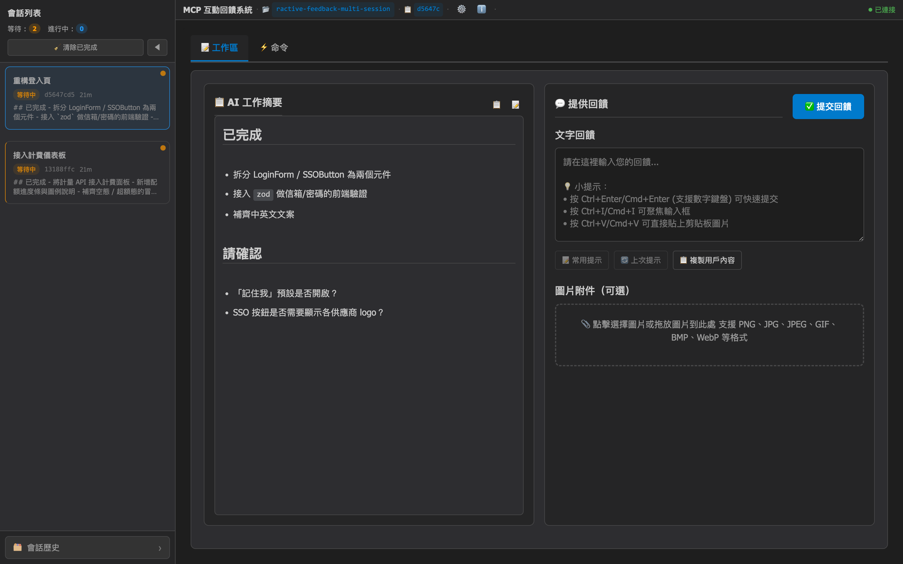
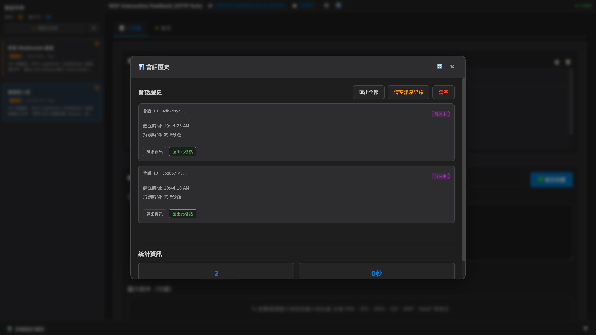

# MCP Feedback Enhanced — HTTP Daemon / 多會話分支

**🌐 語言切換 / Language:** [English](README.md) | **繁體中文** | [简体中文](README.zh-CN.md)

> **這是個人 fork，不是上游專案。**
> 基於 [Minidoracat/mcp-feedback-enhanced](https://github.com/Minidoracat/mcp-feedback-enhanced)（該專案又 fork 自 [Fábio Ferreira 的 interactive-feedback-mcp](https://github.com/fabioferreira/interactive-feedback-mcp)，UI 設計參考自 [sanshao85/mcp-feedback-collector](https://github.com/sanshao85/mcp-feedback-collector)）。
>
> 我（[@0xlane](https://github.com/0xlane)）把傳輸層重寫為 **HTTP daemon + 單實例多會話 + 3 層 UI**，純屬自用改造。本儲存庫的版本號從 **v3.0.0** 起只是因為引入了 breaking change，**不代表承接上游 v2.x 的路線**，我也**不是任何 v2.x 功能的原作者**。v2.x 時代的所有能力都歸功於 Minidoracat 與上游貢獻者，本 fork 僅僅把這些零件重新組裝。

## 🎯 核心概念

這是一個 [MCP 伺服器](https://modelcontextprotocol.io/)，為 AI Agent 提供
**回饋導向的開發工作流程**。它用一個常駐 HTTP daemon 匯聚同機上**所有** AI
Agent 的 `interactive_feedback` 呼叫，把它們統一呈現在**同一個瀏覽器 Tab**
裡，徹底解決 v2.x 中「每 Agent 一個 stdio 實例 / 每次回饋新開瀏覽器視窗」
造成的並發衝突。

透過引導 AI 與使用者確認、而非推測性操作，可將多次工具調用合併為單次回饋
導向請求，節省平台成本、改善開發效率。

**🔑 v3.0 架構關鍵：**

- 🌐 **常駐 HTTP daemon**：一台機器只跑一個 `mcp-interactive-feedback` 行程
  （PID 鎖保護），所有 Cursor / Cline / Windsurf / Augment 透過
  `http://127.0.0.1:8765/mcp/` 共用它。
- 🪢 **真正的多會話**：多個 AI 調用並發送來時，後端同時保留每個會話，前端
  在左側欄列出，使用者可自由切換。
- 📑 **單瀏覽器 Tab**：不會再彈出新視窗 —— 第一次由 daemon 帶起 Tab，之後
  所有新會話重用它，並透過標題 `(N)` + 系統通知提醒。
- 🛰️ **SSH / WSL 友善**：只要能連到 daemon 的 HTTP port 就能工作，不再受
  GUI 依賴限制。桌面外殼（Tauri）於 v3.0 **暫停開發**。

**支援平台：**
[Cursor](https://www.cursor.com) | [Cline](https://cline.bot)
| [Windsurf](https://windsurf.com) | [Augment](https://www.augmentcode.com)
| [Trae](https://www.trae.ai)

### 🔄 工作流程

1. **啟動 daemon**（一次）：在 Clone 好的 repo 裡執行
   `uv run mcp-interactive-feedback serve --http`，預設監聽 `127.0.0.1:8765`。
2. **AI 調用** `interactive_feedback` → daemon 建立一個新的 `WebFeedbackSession`。
3. **UI 匯聚**：同一個瀏覽器 Tab 透過 WebSocket 收到廣播；側欄增量追加卡片，
   **不會**搶走你當前查看的會話。
4. **提醒**：側欄紅點 + 瀏覽器 Tab 標題 `(N)` 前綴 + 可選的系統通知。
5. **使用者回覆**：打字、貼圖、挑命令、送出。草稿在會話間自動保存。
6. **回傳 AI**：回饋回傳給對應 Agent；會話歸檔即從記憶體中物理刪除。
7. **AI 繼續**：依據回饋調整行為或結束任務。

## 🌟 主要功能

### 🪢 單 daemon · 多會話架構（v3.0）

- **HTTP transport**：FastMCP 在 `/mcp/` 下提供 Streamable HTTP 端點，IDE
  以 MCP 協議直連。
- **並發會話**：`WebUIManager` 對每個 `interactive_feedback` 呼叫 new 一個
  `WebFeedbackSession`，並發不受限。
- **Sticky active pointer**：`_active_session_id` 只回應使用者明確切換，
  新進來的會話**不搶視圖**。
- **WebSocket 多路複用**：一條 client WebSocket 承載所有會話事件，斷線
  重連後會補齊 session list。
- **Per-session 草稿**：`SessionDataManager` 記住每個會話的文字 / 圖片 /
  命令 / 超時設定。
- **歸檔 = 物理刪除**：會話完成或手動歸檔都會立即從記憶體清除，側欄不留
  灰色卡片。

### 🏛️ 3 層 UI（v3.0）

- **頂欄（應用級）**：`⚙️ 設定` / `ℹ️ 關於` 以模態視窗開啟，切換會話
  不會影響它們的狀態。
- **左側欄（跨會話）**：即時會話卡片清單 —— 淺色 badge、縮略時間、等待中
  會話紅點。底部 `🗂️ 會話歷史` 按鈕打開全域歷史模態。
- **右欄（會話級 Tab）**：`📝 工作區`（AI 摘要嵌入其中）/ `⚡ 命令` —— 只放
  當前會話的資料，和全域動作在物理上分開。
- **快速切換**：`Cmd/Ctrl+1..9` 跳到對應順序的會話；`Cmd/Ctrl+Enter` 送出。
- **四層提醒**：側欄紅點、Tab 標題 `(N)`、可選系統通知、WebSocket 事件 ——
  無論是否聚焦，都不會錯過待辦。

### 📝 智能工作流程

- **提示詞管理**：常用提示詞 CRUD、使用統計、智能排序。
- **自動定時提交**：1–86400 秒彈性計時器，支援暫停 / 恢復 / 取消。
- **自動執行命令**：新建會話 / 提交後可自動執行預設命令。
- **會話管理追蹤**：本地檔案儲存、歷史模態可匯出 JSON / CSV / Markdown。
- **連線監控**：右上角「● 已連線」指示器懸停時顯示連線時長、重連次數、訊息
  計數、延遲、會話數等診斷資訊，獨立 tick，不依賴 WebSocket 心跳。
- **AI 摘要 Markdown 渲染**：支援標題、程式碼區塊、列表、連結等常見元素。

### 🎨 現代化體驗

- **響應式佈局**：適配不同螢幕尺寸，JS 模組化。
- **音效 + 系統通知**：內建提示音並可自訂；系統級通知提醒遠端事件。
- **智能記憶**：輸入框高度、活躍 Tab、語言偏好持久化。
- **多語言**：繁體中文、英文、簡體中文，即時切換。

### 🖼️ 圖片與媒體

- **全格式支援**：PNG / JPG / JPEG / GIF / BMP / WebP。
- **便捷上傳**：拖拽、剪貼簿貼上（`Cmd/Ctrl+V`）。
- **不限大小**：自動處理。

## 🌐 介面預覽

### Web UI（v3.0 · 3 層資訊架構）

<div align="center">
  
</div>

*v3.0 Web UI —— 兩個並行會話同時匯聚到同一個瀏覽器 Tab。頂部 **頂欄** 放應用級動作
（⚙️ 設定 / ℹ️ 關於）；**左側欄** 列出所有活動會話（當前會話高亮），底部固定一個
`🗂️ 會話歷史` 按鈕；**右欄** 以 Tab 形式只展示**會話級**工作項（`📝 工作區` / `⚡ 命令`，
AI 摘要嵌在工作區裡）。懸停右上角的 `● 已連線` 指示器可以看到連線時間 / 重連次數 /
訊息數 / 延遲 / 會話數等診斷資訊。*

<details>
<summary>📱 點擊查看「會話歷史」模態（跨會話 · 應用級）</summary>

<div align="center">
  
</div>

*從側欄底部點 `🗂️ 會話歷史` 會打開一個應用級模態，遮罩掉會話視圖，顯示當日
會話數、平均時長、匯出 / 清空 等動作。「會話歷史 / 設定 / 關於」都屬於**應用級**，
放在全域模態裡，不會污染每個會話自己的 Tab。*

</details>

> 桌面外殼（Tauri）於 v3.0 **已暫停**。v3 的所有功能均透過瀏覽器訪問
> daemon 完成。計畫恢復時會在這裡同步更新。

**快捷鍵支援**

- `Ctrl+Enter`（Windows/Linux）/ `Cmd+Enter`（macOS）：送出回饋（主鍵盤與數字鍵盤皆支援）
- `Ctrl+V`（Windows/Linux）/ `Cmd+V`（macOS）：直接貼上剪貼板圖片
- `Ctrl+I`（Windows/Linux）/ `Cmd+I`（macOS）：快速聚焦輸入框 （感謝 @penn201500）
- `Cmd/Ctrl+1..9`：切換到側欄中對應位置的會話

## 🚀 快速開始（v3.0）

> **v3.0 破壞性變更** —— 完全移除 stdio 傳輸。本機所有 AI Agent 現在都走
> **同一個常駐 HTTP daemon**（`http://127.0.0.1:8765/mcp/`）。你只啟動一次
> daemon，所有會話匯聚在同一個瀏覽器 Tab 裡。
>
> 從 v2.x 升級？舊版 `mcp.json` 裡 `"command": "uvx", "args": [...]` 的寫法
> 已不再可用，請依下面 **第 2 步** 改為 HTTP 參照。

### 1. Clone 儲存庫並啟動 daemon

> 這個 fork **沒有發佈到 PyPI** —— 我只是自己在用、暫時不想維護公開發行。
> 請直接用 [`uv`](https://docs.astral.sh/uv/) 從原始碼安裝：

```bash
# 若尚未安裝 uv，先裝
pip install uv

# Clone 本 fork
git clone https://github.com/0xlane/mcp-interactive-feedback-multi-session.git
cd mcp-interactive-feedback-multi-session

# 安裝依賴（會自動建立 .venv）
uv sync

# 前景啟動 daemon（Ctrl+C 結束）
uv run mcp-interactive-feedback serve --http
```

Daemon 預設綁定 `127.0.0.1:8765`，並以 PID 鎖
（`~/.config/mcp-feedback-enhanced/daemon.pid`）拒絕第二個實例啟動。
想讓它常駐背景？用 `tmux` / `launchd` / `systemd` / `nohup` 任一種都可以。
可選參數：

| 參數 | 預設 | 說明 |
|---|---|---|
| `--host` | `127.0.0.1` | 建議保持預設 —— 本機使用，不做鑑權 |
| `--port` | `8765` | 連接埠被佔用**直接報錯**，不會自動遞增 |
| `--log-level` | `info` | uvicorn log level |
| `--pid-file` | `~/.config/mcp-feedback-enhanced/daemon.pid` | 多使用者 / 多實例隔離時才需要改 |

> 不想每次都打 `uv run`？`uv sync` 會建立 `.venv/`，
> `source .venv/bin/activate` 一次後就能直接執行 `mcp-interactive-feedback serve --http`。
> 想要全域可用的指令，也可以：`uv tool install --from . mcp-interactive-feedback`。

### 2. 將 `mcp.json` 指向 daemon

`~/.cursor/mcp.json`（或專案層級 `<project>/.cursor/mcp.json`）：

```json
{
  "mcpServers": {
    "mcp-feedback-enhanced": {
      "url": "http://127.0.0.1:8765/mcp/",
      "autoApprove": ["interactive_feedback"]
    }
  }
}
```

- `/mcp/` 結尾的 `/` **必須**保留（Streamable HTTP 端點）；
- 不再需要 `command` / `args` / `env` —— AI Agent 直接走 HTTP；
- 單次呼叫的 `timeout` 欄位對 HTTP transport **無效**（由 MCP 協定自行處理）。

### 3. 打開一次 Web UI

```
http://127.0.0.1:8765/
```

UI 依 **3 層資訊架構**組織，避免全域動作和會話級工作項混在一起：

| 層級 | 位置 | 放什麼 |
|---|---|---|
| **應用全域** | 頂欄右上 | `⚙️ 設定` / `ℹ️ 關於` 圖示按鈕 → 模態 |
| **跨會話** | 左側欄 | 即時會話清單 + 底部 `🗂️ 會話歷史` 按鈕 → 模態 |
| **當前會話** | 右欄 Tab | `📝 工作區`（AI 摘要嵌入其中）/ `⚡ 命令` |

每個並發的 AI 呼叫 `interactive_feedback` 都會在左側欄以卡片出現；點擊卡片
或 `Cmd/Ctrl+1..9` 即可切換。新會話到來時**不會**搶走你當前的視圖 ——
只會透過側欄紅點 + 瀏覽器標題 `(N)` 前綴 + 系統通知提醒。

詳細快捷鍵、每會話草稿行為、歸檔語義見
[docs/architecture/phase3-multi-session-ui-usage.md](docs/architecture/phase3-multi-session-ui-usage.md)。

### 4. 設定提示工程

為了獲得最佳效果，請在 AI 助手中加入以下規則：

```
# MCP Interactive Feedback 規則

注意在任務完成前根據mcp-feedback-enhanced工具的要求進行工具調用
```

## ⚙️ 進階設定

### CLI 參數（v3.0 推薦）

在 v3.0 裡，主機 / 連接埠透過 `mcp-interactive-feedback serve --http` 的
**命令列參數**傳入 daemon，**不再**透過 Agent 側的 `env` 注入。

```bash
uv run mcp-interactive-feedback serve --http \
    --host 127.0.0.1 \
    --port 8765 \
    --log-level info
```

完整清單請見上方 [🚀 快速開始](#-快速開始v30) 中的參數表。

### 環境變數

仍由 daemon 讀取的環境變數只剩兩個：

| 變數 | 用途 | 取值 | 預設 |
|------|------|------|------|
| `MCP_DEBUG` | 打開 MCP/伺服器除錯日誌 | `true` / `false` | `false` |
| `MCP_LANGUAGE` | 強制 UI 語言 | `zh-TW` / `zh-CN` / `en` | 自動偵測 |

語言偵測優先順序：

1. UI 裡儲存的語言設定（最高優先）
2. `MCP_LANGUAGE` 環境變數
3. 系統 locale（`LANG` / `LC_ALL` 等）
4. 回退到繁體中文

> `MCP_WEB_HOST` / `MCP_WEB_PORT` / `MCP_DESKTOP_MODE` 已在 v3.0 移除 ——
> host/port 請走 CLI flags，桌面模式已暫停開發。

### 測試選項

在 Clone 下來的 repo 裡（先 `uv sync` 一次）：

```bash
# 版本
uv run mcp-interactive-feedback --version

# 啟動 daemon（前景）
uv run mcp-interactive-feedback serve --http

# 指定語言啟動
MCP_LANGUAGE=en    uv run mcp-interactive-feedback serve --http
MCP_LANGUAGE=zh-TW uv run mcp-interactive-feedback serve --http
MCP_LANGUAGE=zh-CN uv run mcp-interactive-feedback serve --http

# 除錯輸出
MCP_DEBUG=true uv run mcp-interactive-feedback serve --http
```

### 開發者工作流

這個 fork 只支援原始碼執行，所以開發者安裝 = 使用者安裝：

```bash
git clone https://github.com/0xlane/mcp-interactive-feedback-multi-session.git
cd mcp-interactive-feedback-multi-session
uv sync
```

**本地測試方式**

```bash
# 從原始碼啟動 daemon（兩種等價寫法）
uv run python -m mcp_feedback_enhanced serve --http
uv run mcp-interactive-feedback serve --http

# 或跑測試 harness（自動拉起 Web UI 並保持執行）
uv run python -m mcp_feedback_enhanced test --web

# 單元 / 整合測試
make test                # pytest 完整套件
make test-fast           # 跳過慢速用例
make test-cov            # 覆蓋率報告輸出到 htmlcov/

# 程式碼品質
make check               # 完整 lint + format + type-check
make quick-check         # 快速修復
```

> 桌面建置目標已隨桌面外殼一起移除。本自用分支不再建置 Tauri 桌面 App，
> 原始碼保留在 `src-tauri/` 僅作參考。

**測試說明**

- **功能測試**：完整 MCP 工具流程（建立會話 → 填入回饋 → 歸檔）
- **單元測試**：各模組獨立測試
- **覆蓋率**：HTML 報告輸出到 `htmlcov/`
- **品質檢查**：包含 linting / formatting / type-check


## 🆕 v3.0 與上游 v2.x 的差異

> **範圍說明** —— 所有 **v2.6.x 以及之前**的版本都屬於上游
> [Minidoracat/mcp-feedback-enhanced](https://github.com/Minidoracat/mcp-feedback-enhanced)。
> 本倉庫是自用分支，歷史從 **v3.0.0** 起算，範圍嚴格限定在下方的 HTTP
> daemon / 多會話 / 3 層 UI 改造。本 fork 的詳細歷史請以 `git log` 為準。

### v3.0.0 亮點

- 🌐 **HTTP daemon 模式**：徹底移除 stdio，同機所有 AI Agent 共用一個常駐
  daemon（`uv run mcp-interactive-feedback serve --http`），以 PID 鎖防止多實例。
- 🪢 **真正的多會話**：後端由 `WebUIManager` 並發管理多個 `WebFeedbackSession`，
  每個會話有穩定的 `creation_seq`，供側欄自然排序。
- 📍 **Sticky active pointer**：新會話到來時**不會**搶走你當前查看的會話；
  只透過側欄紅點 + 瀏覽器標題 `(N)` 前綴 + 系統通知提醒。
- 🏛️ **3 層資訊架構**：頂欄放應用級（設定 / 關於），側欄放跨會話（會話清單 /
  會話歷史），右欄 Tab 只放會話級（工作區（AI 摘要嵌入其中）/ 命令）—— 不再
  把全域動作混在每個會話的 Tab 裡。
- ✍️ **每會話草稿**：切換會話時自動保存 / 恢復文字回饋、圖片、命令、超時設定。
- 🗑️ **歸檔 = 物理刪除**：v3.0 明確歸檔語意 —— 完成或手動歸檔會話都會立刻
  從記憶體移除，側欄不再保留灰色「已完成」卡片。
- 🔌 **WebSocket 多路複用**：單條 client WebSocket 就承載所有會話事件；斷線
  後自動重連並補上最新視圖。
- ⚡ **統一快捷鍵**：`Cmd/Ctrl+1..9` 切換前 9 個會話，`Cmd/Ctrl+Enter` 送出。

> **v2.x 破壞性變更**：舊的 stdio `mcp.json`（`command` / `args`）已不再生效。
> 請依 [🚀 快速開始](#-快速開始v30) 改為 HTTP URL 配置。

## 🐛 常見問題

### 🌐 SSH Remote 環境問題

**Q: SSH 遠端環境下瀏覽器打不開 / 無法存取**
A: v3.0 走 HTTP daemon，所以可以把 daemon 綁到 `0.0.0.0` 或做端口轉發：

**方案一：daemon 綁 0.0.0.0（推薦）**

在遠端上（已完成 `git clone` + `uv sync`）直接執行：

```bash
cd /path/to/mcp-interactive-feedback-multi-session
uv run mcp-interactive-feedback serve --http --host 0.0.0.0 --port 8765
```

接著在本地瀏覽器打開：`http://<遠端主機 IP>:8765/`。注意：`0.0.0.0`
代表同一網段都能存取，**沒有鑑權**，僅適合可信任網路。

**方案二：SSH 端口轉發（安全）**

1. 遠端上 daemon 保持預設 `127.0.0.1:8765`
2. 進行 SSH 端口轉發：
   - **VS Code Remote SSH**：`Ctrl+Shift+P` → "Forward a Port" → `8765`
   - **Cursor SSH Remote**：新增端口轉發規則（端口 `8765`）
3. 本地瀏覽器打開：`http://localhost:8765/`

兩種做法都要把 `mcp.json` 裡的 `url` 指向 Agent 所在主機能連到的位址。

**Q: 為什麼沒收到新回饋？**
A: 多半是 WebSocket 斷線。**解法**：刷新瀏覽器 —— daemon 不會丟失會話，
前端會透過 `list_sessions` 自動補齊狀態。

**Q: MCP 工具沒被呼叫起來？**
A: 先確認 daemon 在跑（`curl http://127.0.0.1:8765/api/ping` 應回 200），
再確認 IDE 的 MCP 工具圖示是綠燈。

**Q: Augment 無法啟動 MCP**
A: 完全關閉並重新啟動 VS Code / Cursor，再重新打開專案。

### 🔧 一般問題

**Q: 還能用桌面應用嗎？**
A: v3.0 的 Tauri 桌面外殼**已暫停**。目前統一採「常駐 HTTP daemon + 瀏覽器」
架構。未來若恢復，會以套殼 daemon 的形式上線，不再回到「每 Agent 一個行程」
的舊模型。

**Q: 我舊的 `mcp.json` 無法運作了？**
A: v3.0 **不再支援** `command` + `args` 形式的 stdio 啟動。把設定改成
[🚀 快速開始](#-快速開始v30) 的 `"url": "http://127.0.0.1:8765/mcp/"` 即可。
所有執行 Agent 的 IDE 共用同一個 daemon。

**Q: Daemon 起不來 —— "address already in use" / "daemon already running"**
A: v3.0 的 daemon 有 PID 鎖 `~/.config/mcp-feedback-enhanced/daemon.pid`，
阻止第二個實例。若 daemon 異常結束殘留鎖檔，刪掉該檔再重新啟動即可。
連接埠衝突請改 `--port`。

**Q: 出現 "Unexpected token 'D'" 錯誤**
A: 除錯輸出污染 MCP 協定流。設定 `MCP_DEBUG=false` 或移除該環境變數。

**Q: 圖片上傳失敗**
A: 檢查檔案格式（PNG / JPG / JPEG / GIF / BMP / WebP）。系統支援任意大小。

**Q: Web UI 起不來 / 連不上**
A: 檢查防火牆是否擋住 daemon 連接埠（預設 `8765`），或改別的連接埠：`--port <other>`，並同步更新 `mcp.json` 裡的 URL。

**Q: UV Cache 佔用過多磁碟空間**
A: 由於頻繁使用 `uvx` 命令，cache 可能會累積到數十 GB。建議定期清理：
```bash
# 查看 cache 大小和詳細資訊
python scripts/cleanup_cache.py --size

# 預覽清理內容（不實際清理）
python scripts/cleanup_cache.py --dry-run

# 執行標準清理
python scripts/cleanup_cache.py --clean

# 強制清理（會嘗試關閉相關程序，解決 Windows 檔案佔用問題）
python scripts/cleanup_cache.py --force

# 或直接使用 uv 命令
uv cache clean
```
詳細說明請參考：[Cache 管理指南](docs/zh-TW/cache-management.md)

**Q: AI 模型無法解析圖片**
A: 各種 AI 模型（包括 Gemini Pro 2.5、Claude 等）在圖片解析上可能存在不穩定性，表現為有時能正確識別、有時無法解析上傳的圖片內容。這是 AI 視覺理解技術的已知限制。建議：
1. 確保圖片品質良好（高對比度、清晰文字）
2. 多嘗試幾次上傳，通常重試可以成功
3. 如持續無法解析，可嘗試調整圖片大小或格式

## 🙏 致謝

本 fork 站在巨人的肩膀上。我只是重塑了傳輸與 UI 層 —— 其餘幾乎所有功能
都是由下面的上游作者們完成的：

- [**Fábio Ferreira**](https://github.com/fabioferreira) — 原始專案 **interactive-feedback-mcp** 的作者
- [**Minidoracat**](https://github.com/Minidoracat) — **mcp-feedback-enhanced** 的作者，也是本 fork 的直接上游（v2.6.x 及之前的一切都是他們的作品）
- [**sanshao85**](https://github.com/sanshao85) — UI 設計靈感來源 **mcp-feedback-collector**
- 上游貢獻者：**penn201500**、**leo108**、**Alsan**、**fireinice**

若本工具對你有幫助，也請給上游專案 star / 贊助 —— 真正重活都在那邊。

### 社群支援
- **Issues：** [GitHub Issues](https://github.com/0xlane/mcp-interactive-feedback-multi-session/issues)

## 📄 授權

MIT 授權條款 - 詳見 [LICENSE](LICENSE) 檔案

## 📈 Star History

[](https://star-history.com/#0xlane/mcp-interactive-feedback-multi-session&Date)

---
**🌟 歡迎 Star 並分享給更多開發者！**
