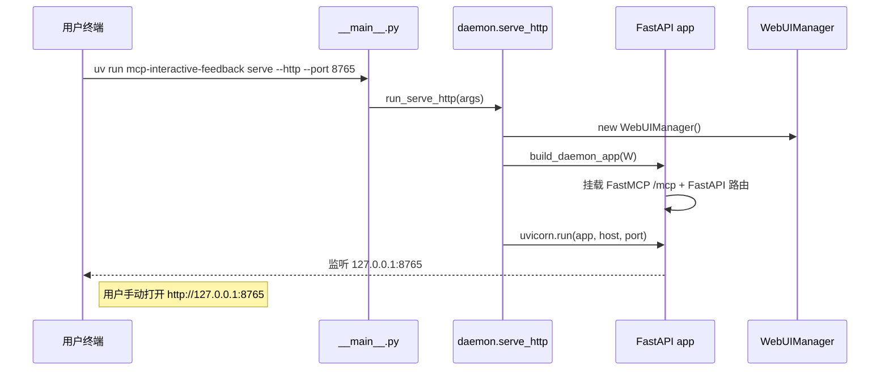
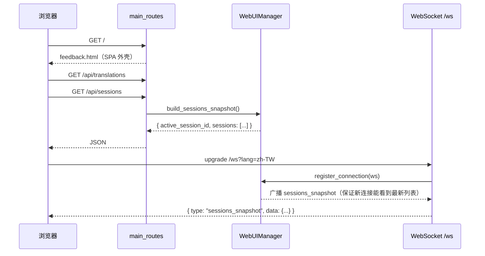
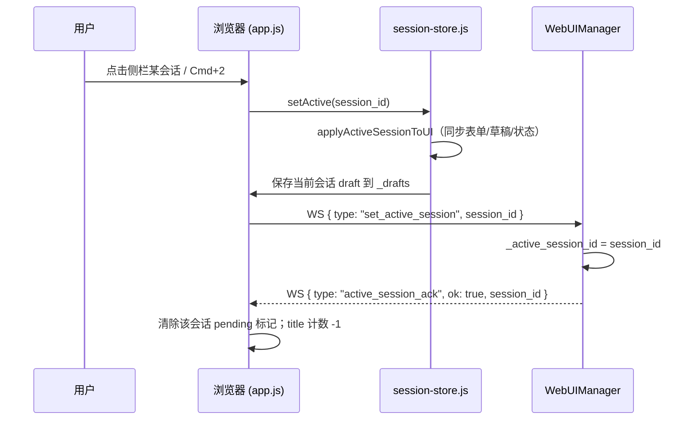
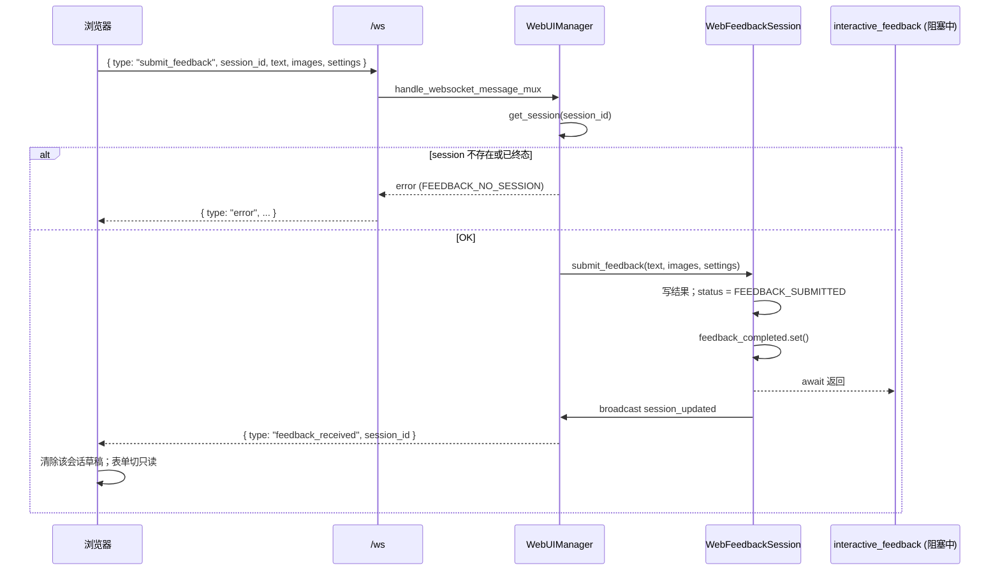
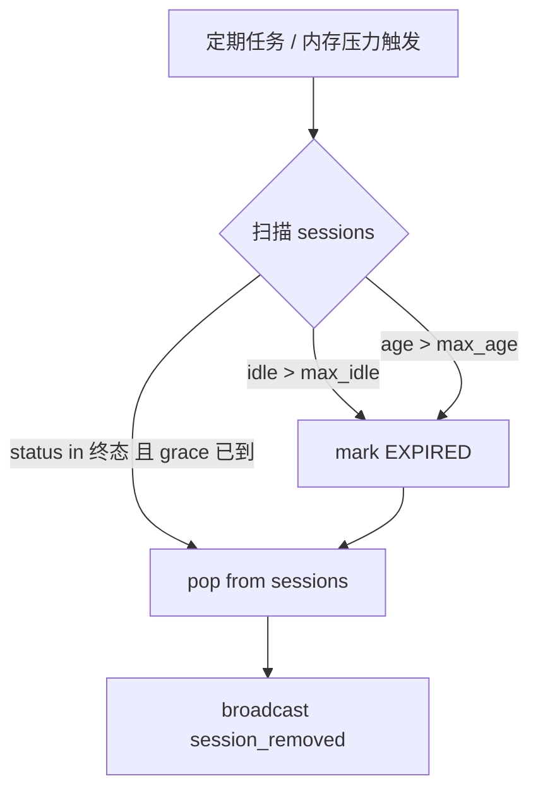
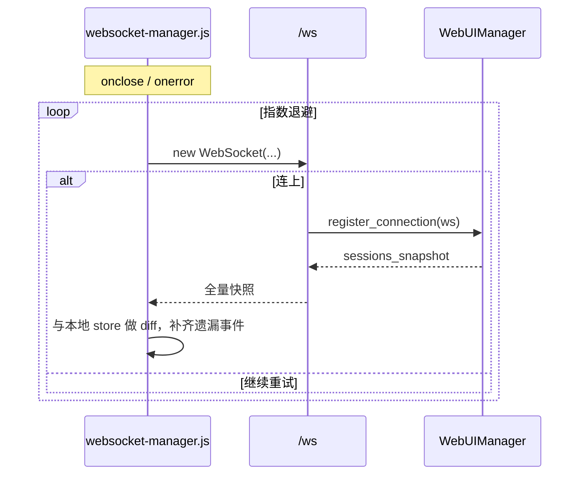
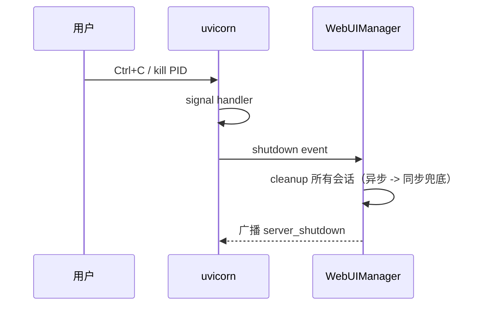

# 交互流程 · v3.0

> 本文档用序列图 / 流程图说明 v3.0 下几个核心流程是怎么串起来的。
> 模块的职责与接口见 [`component-details.md`](./component-details.md)，
> 消息细节见 [`api-reference.md`](./api-reference.md)。

---

## 1. Daemon 启动



关键点：

- 端口被占用时直接失败（不做自动递增），方便 `mcp.json` 配固定 URL。

---

## 2. 浏览器首次连接



- 页面渲染 **不依赖 `window.onload` 时的 REST**：SPA 启动后立刻打开
  WS 并订阅 `sessions_snapshot`，保证后续 `create_session` 广播能
  正确插入侧栏。
- `GET /api/sessions` 只是为了首屏快速有内容；后续一切靠 WS 增量。

---

## 3. AI Agent 触发一次反馈

```mermaid
sequenceDiagram
    participant A as AI Agent
    participant MCP as FastMCP /mcp
    participant S as server.interactive_feedback
    participant W as WebUIManager
    participant SE as WebFeedbackSession
    participant B as 浏览器

    A->>MCP: tools/call interactive_feedback
    MCP->>S: interactive_feedback(summary, title, timeout)
    S->>W: create_session(project, summary, title)
    W->>W: 新 session_id，prior_active_valid 检查
    W-->>S: session_id
    S->>W: get_session(session_id)   // 精确查找，避免串线
    W-->>S: WebFeedbackSession

    W->>B: broadcast session_created（含 has_pending_notification）
    B->>B: sessionStore 插入；侧栏加卡片；title (N)；favicon 红点
    alt 用户当前没在看任何会话
        B->>B: 自动切到新会话
    else 正在看别的会话
        B->>B: 仅置 pending，视图不动
    end

    S->>SE: await wait_for_feedback(timeout)
    Note right of SE: 协程阻塞在 feedback_completed 事件

    B->>WS: submit_feedback { session_id, text, images }
    WS->>SE: submit_feedback(...)
    SE->>SE: status = FEEDBACK_SUBMITTED; event.set()
    SE-->>S: (await 返回)
    S-->>MCP: TextContent + ImageContent
    MCP-->>A: 工具响应
```

注意：

- **粘滞活跃指针**：用户在看 Session A 时 Agent 触发 Session B，
  `_active_session_id` 不会被改，前端只是挂 pending。
- `interactive_feedback` 内部一定要 `get_session(session_id)`，不能
  用 `get_current_session()`，否则不同会话会等到同一个
  `feedback_completed`（历史 bug 回归测试见
  `tests/unit/test_multi_session.py::test_session_lookup_by_id_after_sticky_active`）。

---

## 4. 用户切换活跃会话



这个流程还会：

- 从 `_drafts[session_id]` 读回之前未提交的草稿文本；
- 根据会话的 `status` 调用 `_syncFeedbackStateToSession` 映射到
  `uiManager.feedbackState`（WAITING/SUBMITTED/READONLY 等）。

---

## 5. 提交反馈（含跨会话隔离）



- **严格 `session_id` 路由**保证多个并行 session 的反馈不会串线。
- 提交成功后前端自动清空 `_drafts[session_id]`，避免刷新后残留草稿。

---

## 6. 归档与清理

### 6.1 前端手动归档 / 清除

```mermaid
sequenceDiagram
    participant U as 用户
    participant B as 浏览器
    participant R as main_routes
    participant W as WebUIManager

    U->>B: 点击卡片的「清除」或批量清理
    B->>R: POST /api/sessions/{sid}/archive
    R->>W: archive_session(sid)
    W->>W: sessions.pop(sid); _session_creation_order.pop(sid)
    W->>B: broadcast session_removed
    B->>B: sessionStore 移除；若是当前活跃则切回 empty / fallback
```

> 「归档」= 物理删除。这是 Phase 3 为修复「刷新后已归档会话重新出现」
> 调整的语义。若将来需要"软归档"，需另起字段并调整 snapshot 过滤。

### 6.2 后端自动清理



入口：
`WebUIManager.cleanup_expired_sessions()` /
`cleanup_sessions_by_memory_pressure(force=False)`。
两者共用 `_scan_expired_sessions()` 产生候选列表。

---

## 7. WebSocket 断线重连



- 重连后**一定**要让后端重发 `sessions_snapshot`；前端不保证自己有
  完整的历史事件（掉线期间的 `session_created` / `session_updated`
  可能全部错过）。
- `set_active_session` 在重连后会由 `app.js` 再发一次，避免后端指针
  与前端视图不一致。

---

## 8. Daemon 关停



---

## 9. 首帧性能 / 冷启动关键路径

```
uvx invoke ────► Python import ─────► FastMCP.http_app() ──► FastAPI ready
                (~1s, 含依赖解析)       (~200ms)                 (~50ms)
                                                                    │
                                              WebUIManager 单例初始化
                                                                    │
                                                             uvicorn.run 监听
                                                                    │
用户打开浏览器 ─► GET / ─► HTML 渲染 ─► ES modules 加载 ─► WS 连接
                                                                    │
                                                    sessions_snapshot 到达
                                                    SPA 渲染侧栏 + 空态主区
```

- 受 `uvx` 依赖缓存影响，冷启动首次可能 1–3 秒；测试阈值已放宽到
  60s 启动 / 30s 初始化，避免 CI 假阳。

---

**文档版本**：v3.0.0-dev · **最后更新**：2026-04-22
