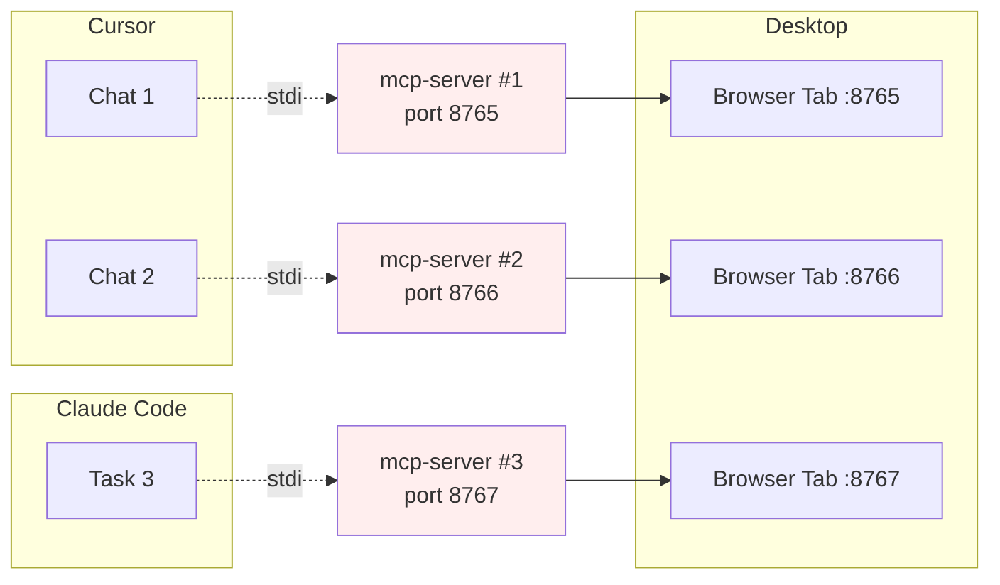
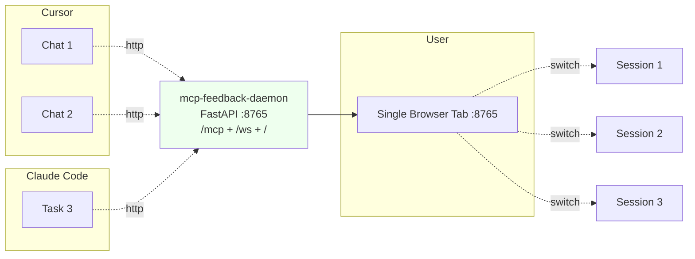
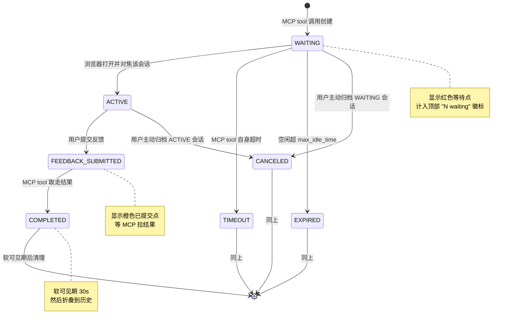

# 多会话 HTTP 模式重构设计

> **状态**：阶段 1 / 阶段 2 / 阶段 3 全部完成；阶段 4 / 5 持续收尾中
> **创建日期**：2026-04-22
> **最后更新**：2026-04-22（阶段 3 实施完成：WS 多路复用 + 双栏 UI + 粘滞 active 指针 + 跨会话串线修复）
> **涉及范围**：MCP 传输层、Web UI 管理层、前端交互层
> **预期版本**：v3.0.0（**破坏性变更**：完全移除 stdio 模式，不保留兜底）
>
> 阶段 3 相关使用文档：[phase3-multi-session-ui-usage.md](./phase3-multi-session-ui-usage.md)

## 1. 背景

### 1.1 现状痛点

当前项目 (`v2.6.0`) 采用 **"stdio MCP + 单活跃会话 + 每进程一端口"** 的架构：

- 每个 AI Agent（Cursor / Claude Code / Windsurf / ...）通过 stdio 拉起一个独立的 `mcp-interactive-feedback` 子进程；
- 每个子进程里 `WebUIManager` 是**单例**，启动自己的 FastAPI+uvicorn 服务器，监听独立端口（默认 `8765`，冲突时自动递增）；
- 每次 `interactive_feedback` 工具被调用，会在当前进程里创建会话，并**打开一个新浏览器 Tab**（或复用同进程内已有 Tab）;
- 同一进程内多次调用遵循"单活跃会话 + WebSocket 迁移"语义：新会话挤掉旧会话，WS 被转移，前端刷新显示新会话。

由此产生的用户可观察问题：

| 痛点 | 根因 |
|---|---|
| 一个用户常年能看到十几个 `MCP Feedback` 浏览器 Tab | N 个 Agent → N 个进程 → N 个端口 → N 个 Tab |
| 切换 Tab 时找不到哪个在等反馈 | 没有全局入口，每个 Tab 只知道自己进程里的会话 |
| Cursor IDE 多 Chat 并行时配置文件写冲突 | `session_history.json` / `ui_settings.json` 被多个进程同时写 |
| 端口随机化导致难以用固定 URL 访问 | `PortManager.find_free_port_enhanced` 自动递增 |
| 关掉 Tab 会误伤正在等待的 Agent | Tab 与进程生命周期未解耦 |

### 1.2 需求目标

1. **单实例多会话**：全机器/单用户只保留一个守护进程；
2. **HTTP 传输**：AI Agent 侧通过 HTTP 连接 MCP，不再 fork 子进程；
3. **单浏览器页面聚合所有会话**：用户只面对一个 Tab 即可处理来自任意 Agent 的反馈请求；
4. **明确的会话切换、通知、归档语义**；
5. **在不损失现有功能**（命令执行、图片上传、Markdown 摘要、i18n、音效、通知、桌面模式）**的前提下完成**。

## 2. 技术可行性

**可行**，且改造路径与现有代码高度契合：

| 现有能力 | 对新架构的贡献 |
|---|---|
| FastAPI + uvicorn 已做后端 | 直接作为 HTTP 容器，FastMCP 2.x 原生支持挂载到 FastAPI |
| `sessions: dict[str, WebFeedbackSession]` 多会话容器已存在 | 去掉 `current_session` 包装层即可复用 |
| `/api/all-sessions` 已能返回全量会话 | 新 UI 的侧栏数据源 |
| `WebFeedbackSession` 状态机、清理管理器、内存监控器 | 全部复用，仅需少量语义调整 |
| `notification-manager.js`、`audio-manager.js`、i18n、Markdown 渲染 | 全部复用 |
| Tauri 桌面壳是个 WebView 套 URL | HTTP 改造对它透明 |

主要变更集中在：**传输层切换、进程模型、`current_session` 语义解除、前端改双栏、新增归档 API**。

## 3. 目标架构

### 3.1 进程模型对比

#### 当前（单进程单会话）



#### 目标（单守护多会话）



### 3.2 四层架构对照

| 层 | 当前实现 | 目标实现 |
|---|---|---|
| MCP 服务层 | `mcp.run()` 默认 stdio | `mcp.run(transport="http")` 或挂载为 FastAPI 子应用 |
| Web UI 管理层 | `WebUIManager.current_session` 单活跃 | `WebUIManager.sessions` 多会话字典，无 current 概念 |
| Web 服务层 | 每进程独立 uvicorn | 单守护进程，FastMCP 与 Web UI 共享 ASGI 应用 |
| 前端交互层 | 单页单会话（`feedback.html` 嵌入当前会话数据） | 双栏布局（左会话列表 + 右详情），WS 多路复用 |

## 4. 影响矩阵

### 4.1 需要删除 / 重构

| 位置 | 原因 |
|---|---|
| `WebUIManager.current_session` 相关字段与方法 | 多会话下无此概念 |
| `WebUIManager.create_session` 中"旧会话转 COMPLETED + WebSocket 迁移给新会话"（`web/main.py:335-404`） | 新会话不应挤掉旧会话 |
| `WebUIManager.smart_open_browser` 中的刷新通知逻辑 | 改为"无 WS 连接时才开 Tab" |
| `WebUIManager._pending_session_update` | 改为向所有 WS 广播 `session_created` 事件 |
| `WebUIManager.notify_existing_tab_to_refresh` | 语义变为"广播 session 列表变更" |
| `/` 路由根据 `current_session` 返回不同模板 | 改为总是返回"会话列表壳"，数据前端拉取 |
| `/ws` 隐式绑定 `manager.get_current_session()`（`routes/main_routes.py:258-276`） | 改为多路复用，消息携带 `session_id` |
| `/api/session-status`、`/api/current-session`（或保留仅供兼容） | 冗余，被 `/api/sessions` 取代 |
| `launch_web_feedback_ui` 中的"懒启动服务器 + 每次开浏览器" | 守护模式下服务器常驻 |
| `PortManager.find_free_port_enhanced` 在守护模式下的"自动切换端口" | 守护模式端口必须固定，冲突时应报错而非递增 |
| `session-data-manager.js` "新会话来 → 旧会话进历史记录"（`session/session-data-manager.js:54-93`） | 多会话下旧会话应继续存在 |
| `feedback_session.py:submit_feedback` 中"桌面模式提交后立即关窗" | 桌面模式改为常驻窗口 |

### 4.2 需要新增

**后端**

- `mcp-interactive-feedback serve --http [--host 127.0.0.1] [--port 8765]` 子命令
- 单实例锁（PID 文件 + 端口占用检测）
- FastAPI 挂载 MCP ASGI 子应用
- 新 API：
  - `GET /api/sessions` — 活跃 + 最近完成的全量会话（已有 `/api/all-sessions`，扩展字段即可）
  - `POST /api/sessions/{sid}/submit` — REST 入口提交反馈（补 WS）
  - `POST /api/sessions/{sid}/archive` — 手动归档/取消
  - `DELETE /api/sessions?status=completed` — 批量清理
- WebSocket 多路复用协议（见 §5.2）
- 客户端断连探测（FastMCP 可感知 HTTP 请求断开，用于主动释放 `wait_for_feedback`）
- 优雅关机：收到 SIGTERM 时通知所有 WS + 让所有 WAITING 会话返回

**前端**

- `SessionSidebar` 组件（左栏）
- `SessionDetailPane`（右栏，复用现有 `feedback.html` 的反馈 UI）
- 每会话 state 隔离（草稿、未提交图片、命令输出缓存）
- 标题栏与 favicon 红点徽标
- 归档按钮（含二次确认分支）
- 音效/浏览器通知接线到 `session_created` 事件

**配置与文档**

- `mcp.json` 迁移示例（stdio → http url）—— 让用户手动替换
- 启动命令使用说明（README / 用户指南）

### 4.3 保留不动

- `WebFeedbackSession` 核心状态机与清理逻辑
- 图片处理、命令执行、Markdown 渲染、i18n、音效、通知管理器
- `session_cleanup_manager`、`memory_monitor`、`resource_manager`
- Tauri 桌面壳（仅需去掉"提交即关窗"分支）

## 5. 关键技术设计

### 5.1 MCP HTTP 传输与 FastAPI 合并

推荐方式：把 MCP 作为 ASGI 子应用挂到现有 FastAPI 上，共享端口。

```python
from fastmcp import FastMCP
from fastapi import FastAPI

mcp = FastMCP("interactive-feedback")

@mcp.tool()
async def interactive_feedback(...):
    ...

# 生成 MCP 的 ASGI 应用
mcp_app = mcp.http_app(path="/mcp")

# 使用其 lifespan 以确保 session manager 正确启动
app = FastAPI(lifespan=mcp_app.lifespan)
app.mount("/mcp", mcp_app)

# 原有路由继续注册到 app
setup_routes(app)
```

Agent 端的 `mcp.json` 由

```json
{
  "mcpServers": {
    "interactive-feedback": {
      "command": "uvx",
      "args": ["mcp-interactive-feedback"]
    }
  }
}
```

改为

```json
{
  "mcpServers": {
    "interactive-feedback": {
      "url": "http://127.0.0.1:8765/mcp"
    }
  }
}
```

### 5.2 WebSocket 多路复用协议

一个浏览器 Tab 只开一个 `/ws` 连接。消息一律携带 `session_id`（广播类事件的 `session_id` 指示事件归属）。

**服务端 → 客户端**

| `type` | 说明 |
|---|---|
| `sessions_snapshot` | 连接建立时推送全量会话状态 |
| `session_created` | 新会话出现（由 MCP 工具调用触发） |
| `session_updated` | 会话状态变化（status/status_message/last_activity） |
| `session_feedback_submitted` | 某会话反馈已提交 |
| `session_archived` | 某会话被归档（终态或用户手动） |
| `session_expired` | 服务端清理过期会话 |
| `command_output` | 命令执行输出（带 `session_id`） |
| `command_complete` | 命令结束 |
| `notification` | 通用通知（沿用现有） |
| `server_shutting_down` | 优雅关机预告 |

**客户端 → 服务端**

| `type` | 说明 |
|---|---|
| `submit_feedback` | `{session_id, feedback, images, settings}` |
| `run_command` | `{session_id, command}` |
| `archive_session` | `{session_id}` |
| `cancel_session` | `{session_id}`（等同于归档 WAITING 态） |
| `heartbeat` | 心跳 |
| `subscribe` | 可选，用于未来做按需订阅 |

### 5.3 会话生命周期与归档



**归档语义矩阵**（对应用户"客户端未发结束事件时如何手动归档"的问题）：

| 触发时会话状态 | 归档语义 | 服务端动作 | UI 行为 |
|---|---|---|---|
| `WAITING` / `ACTIVE`（MCP tool 阻塞在 `wait_for_feedback`） | **取消**：让 Agent 拿到"用户取消" | 设 `feedback_result = None`，`feedback_completed.set()`，走清理；MCP tool 返回 `TextContent("用户取消了反馈。")` | 二次确认弹窗 |
| `FEEDBACK_SUBMITTED`（已提交，MCP 尚未取走） | 几乎不触发；触发则仅 UI 隐藏，服务端保留 | 仅标记 UI 隐藏 | 无确认 |
| `COMPLETED` / `TIMEOUT` / `EXPIRED` / `ERROR`（终态） | 纯 UI 清理 | 从 `sessions` 字典移除，写入 `session_history.json` | 无确认 |

**自动归档流程**：

1. 会话进入终态 → UI 侧栏保持 **软可见期**（默认 30s，可配置）显示"✓ 刚刚完成"；
2. 软可见期后折叠到"最近历史"区域（默认最多保留 10 条，可展开）；
3. `session_cleanup_manager` 周期扫描，终态且超过 N 分钟（默认 5）的会话从内存移除，metadata 追加写到 `session_history.json`。

**孤儿检测**（MCP 客户端异常断连，服务端不知情）：

- HTTP 传输下 FastMCP 可感知 `Request.is_disconnected()`；在 `wait_for_feedback` 循环中周期检查（如每 5s），一旦客户端消失主动释放会话；
- 兜底：现有 `max_idle_time` 默认 3600s 过期清理。

### 5.4 前端双栏 UI

```
┌───────────────────────────────────────────────────────────────┐
│  MCP Feedback                ● 2 waiting       [设置][主题][?]│
├───────────────────┬───────────────────────────────────────────┤
│  会话                │  项目：/path/to/backend                  │
│                   │  Agent：Cursor · 32s ago                   │
│  ● backend (32s)  │  ────────────────────────────────────────── │
│  ● frontend (8s)  │  ## AI 摘要                                │
│  ○ api-docs       │  （Markdown 渲染，支持复制）               │
│  ✓ refactor (刚完成)│                                          │
│  ────             │  ────────────────────────────────────────── │
│  历史（3）▾       │  你的反馈：                                │
│                   │  [textarea，每会话独立草稿]                │
│  [清空已完成]      │  [图片上传]  [命令执行]                    │
│                   │  [提交]       [取消此会话]                 │
└───────────────────┴───────────────────────────────────────────┘
```

**排序规则**：
- 第一组：`WAITING` / `ACTIVE`（红点 / 实心圆），按"等待时间最久"降序；
- 第二组：`FEEDBACK_SUBMITTED`（橙点），按时间降序；
- 第三组：终态（灰勾 / 灰叉），按时间降序；折叠到"历史"。

**切换体验**：
- 点击左栏只改右栏，无 URL 跳转（可选 `#session-id` hash 以支持刷新恢复）；
- 切换时自动保存当前草稿（`localStorage["draft:" + sid]`）；
- 键盘：`⌘/Ctrl + 1..9` 跳到第 N 个；`⌘/Ctrl + Enter` 提交；`Esc` 归档当前。

**通知堆叠**（从弱到强，默认全开，可在设置里按需关闭）：

1. `document.title` = `(N) MCP Feedback` — N 为等待中数量；
2. Favicon 红点（Canvas 动态绘制）；
3. 侧栏脉动动画；
4. 浏览器 Desktop Notification（复用 `notification-manager.js`，仅页面失焦/隐藏时触发，已具备）；
5. 音效（复用 `audio-manager.js`，默认关闭以免打扰）；
6. （Tauri 桌面模式）Dock / Taskbar 徽标 `app.set_badge_count(N)`。

### 5.5 会话标识

使用场景是 Cursor IDE / Cursor CLI，为此给 `interactive_feedback` tool 加一个**可选的会话标题**参数，让 AI 自己起一个人类可读的短标题（比如当前任务主题）：

```python
@mcp.tool()
async def interactive_feedback(
    project_directory: str = ".",
    summary: str = "...",
    timeout: int = 3600,
    title: str | None = None,  # 新增：会话标题，用于侧栏识别
) -> list: ...
```

**UI 侧栏显示规则**：

- 主文：`title`（AI 传入）或 `basename(project_directory)`（未传入时兜底）
- 副文：`summary` 截断到 50 字
- 状态点：颜色 + 文字（`● 等待 · 32s` / `● 进行中` / `✓ 刚完成`）

Prompt 里建议引导 AI 用短语做标题（如 `"修复登录重定向"`、`"API 文档补全"`），而不是冗长描述。文档/示例会在用户指南里给出样板。

## 6. 启动与运行模型

### 6.1 启动方式

**保持与当前一致**——用户手动执行一条命令即可，不提供 LaunchAgent / systemd / Task Scheduler 等服务化方案（个人本地使用场景，保持简单）：

```bash
# 首次使用前手动启动一次，进程常驻（从 clone 的仓库目录执行）
uv run mcp-interactive-feedback serve --http

# 激活 .venv 后的等价写法
mcp-interactive-feedback serve --http
```

参数：

| 参数 | 默认值 | 说明 |
|---|---|---|
| `--host` | `127.0.0.1` | 固定绑本地回环，不对外暴露 |
| `--port` | `8765` | 固定端口，冲突时直接报错退出 |

### 6.2 单实例锁

- `~/.config/mcp-feedback-enhanced/daemon.pid` 写入 PID；
- 启动时检测：PID 存在且进程仍在 → 拒绝启动并提示已在运行；
- PID 存在但进程已死 → 清理后继续；
- 端口被占 → 不自动切换端口，直接报错提示用户手动处理。

### 6.3 鉴权

**不启用**。使用场景是本地单用户（`127.0.0.1`），无需 Token。

### 6.4 Agent 端配置

用户手动把 `mcp.json` 从 stdio 形式改为 HTTP 形式（见 §5.1 示例）。不提供自动迁移命令。stdio 模式**不保留兜底**——直接在 v3.0 切换，改造彻底。

## 7. 未提但需考虑的问题清单（含决议）

| # | 问题 | 最终决议 |
|---|---|---|
| 1 | Agent 身份识别 | 新增 `title` 可选参数；未传则用 `basename(project_directory)` 兜底。见 §5.5 |
| 2 | URL Token 鉴权 | **不启用**。仅绑 `127.0.0.1`，本地单用户不需要 |
| 3 | 首次浏览器 Tab 打开时机 / 竞态 | `asyncio.Lock` 包住"检测 WS + 开 Tab"，无 WS 时才 `webbrowser.open` |
| 4 | Tab 关闭后再次 MCP 调用 | 同 #3，自动重开 |
| 5 | `session_history.json` 长期膨胀 | 限条数 500 + 尺寸 2MB + 大会话截断摘要 |
| 6 | 全局单守护 vs 按项目 | 仅全局单守护，不支持 `--instance-id`（个人本地使用，不做团队场景） |
| 7 | Tauri 桌面模式 | **暂停维护**。v3.0 发布只支持浏览器 Tab；源码保留，CI 不构建 desktop binary；README 明确说明 |
| 8 | 并发命令执行限流 | `max_concurrent_commands = 5`（全局默认），超限排队，不暴露配置开关 |
| 9 | 多会话自动化测试 | 新增并发创建 / WS 多路复用 / 归档解锁 `wait_for_feedback` 的集成测试 |
| 10 | 优雅关机 | SIGTERM → 广播 `server_shutting_down` → 所有 WAITING 返回 canceled → 写 history → 释放端口 |
| 11 | i18n 新词条 | 侧栏、归档、取消确认、批量操作——三语（zh-TW / zh-CN / en）全补 |
| 12 | `current_session` 代码引用范围 | 全局搜索 + 清除（包括 `tests/`、桌面模块）；无兼容包袱 |
| 13 | 历史会话数据隐私 | 沿用现有三级隐私控制，不新增 |
| 14 | 启动方式 | 保持与当前一致的用户手动命令启动（`uvx`/`pip`），不提供服务化部署模板 |
| 15 | 向后兼容 | **不保留 stdio 兜底**，v3.0 直接切换；用户手动改 `mcp.json` |

## 8. 分阶段落地路线

每阶段均可独立 merge 并保持功能可用。

### 阶段 1：后端多会话化（UI 暂不动）

- 移除 `current_session` 相关逻辑；
- 重写 `create_session` 为纯插入；
- `/ws` 改为多路复用；
- `/api/all-sessions` 字段补齐；
- 单元测试：并发创建 / 并发提交 / 归档 WAITING 解锁 `wait_for_feedback`。

**验收**：服务器能并发持有多个会话且相互不干扰；UI 暂时只显示最新会话（与现行外观一致）。

### 阶段 2：HTTP MCP 传输 + 守护模式 ✅ 已完成

**落地清单**：

- ✅ `src/mcp_feedback_enhanced/daemon.py`：`build_daemon_app(host, port)` 把
  `mcp.http_app(path="/")` 挂载到 FastAPI `/mcp`，`serve_http(host, port, pid_path)`
  前台运行 uvicorn；
- ✅ `src/mcp_feedback_enhanced/utils/pid_lock.py`：`DaemonPidLock` 单例锁，
  默认写 `~/.config/mcp-feedback-enhanced/daemon.pid`，支持 stale lock 回收；
  清理策略依赖 `atexit`（uvicorn 对 SIGINT/SIGTERM 的优雅关机会触发
  正常退出链），不自装 signal handler 以免与 pytest / ResourceManager /
  uvicorn 的清理链相互干扰；`MCP_FEEDBACK_PID_FILE` 环境变量可覆盖默认路径；
- ✅ `WebUIManager` 新增 `is_daemon` + `lifespan` 参数，daemon 模式下跳过
  `start_server` / 端口自动递增 / `smart_open_browser`；
- ✅ `launch_web_feedback_ui` daemon 分支：仅 `create_session` +
  `notify_existing_tab_to_refresh`，不再自启 uvicorn；
- ✅ `__main__.py` 新增 `serve` 子命令（`--http / --host / --port /
  --log-level / --pid-file`），`AlreadyRunningError` 转成非零退出码；
- ✅ 集成测试 `tests/integration/test_daemon_http.py`（8 个 test，含
  `/` / `/api/all-sessions` / `/mcp/ initialize` / `tools/list` / 全局
  manager 注入 / PID 锁冲突）+ 单元测试 `tests/unit/test_pid_lock.py`
  （12 个 test）；
- ✅ 使用指南 [`phase2-http-daemon-usage.md`](./phase2-http-daemon-usage.md)
  （`uvx serve --http` 启动、`mcp.json` 迁移样例、端点清单、FAQ）；
- ⏳ 三语种 README 正式更新推迟到阶段 5 统一做。

**验收**：单守护进程可同时服务多个 Agent 的并发 MCP 调用；经过真实
`python -m mcp_feedback_enhanced serve --http --port 18765` 子进程 + `curl`
握手验证 MCP initialize / tools/list 全绿；全量 `pytest` 跑下来只有 7 个
pre-existing failure（与 `main` baseline 完全一致），Phase 2 新加的 33 个
test 全过，没有引入新回归。

### 阶段 3：前端双栏 UI ✅ 已完成

**落地清单**：

- ✅ 新增 `session-store.js`：会话集中式状态 + 订阅事件
  （`ACTIVE_CHANGED` / `SESSION_ADDED` / `SESSION_UPDATED` / `SESSION_REMOVED`
  / `SNAPSHOT_APPLIED`），对外只读；`upsertSession` 只在「当前无活跃会话」
  时才自动激活新会话，呼应粘滞语义；
- ✅ 新增 `session-sidebar.js` + `session-sidebar.css`：按创建时间
  降序渲染会话卡片，支持 `WAITING` 脉动动画、`pending` 小红点、归档按钮、
  侧栏折叠（`localStorage` 持久化）；点击卡片发 `ACTIVE_CHANGED` 并触发
  `set_active_session` 告知后端；
- ✅ 新增 `notify-badge.js`：`document.title` 前缀 `(N)` + Canvas 生成
  favicon 红点 + 浏览器 Desktop Notification（全部可选）；`Cmd/Ctrl+1..9`
  按侧栏相同顺序跳到第 N 个会话；`MutationObserver` 保护 `(N)` 前缀不被
  其他代码（如 `refreshPageContent`）意外抹掉；
- ✅ 改造 `websocket-manager.js`：事件按 `session_id` 路由进 store，
  `session_created` 事件当用户正在看别的会话时给新会话打
  `has_pending_notification` 标记，由侧栏转为红点 + 通知；
- ✅ 改造 `app.js`：
  - `_drafts` 每会话独立草稿，切会话自动保存 + 恢复 textarea 内容；
  - `applyActiveSessionToUI` 向后端发 `set_active_session`，保证
    `sessions_snapshot.is_current` 与 `/api/current-session` 跟随前端视图；
  - `_renderEmptyState` 无 active 会话时显示友好占位 + 禁用表单；
  - `_syncFeedbackStateToSession` 把 `WAITING` / `FEEDBACK_SUBMITTED` /
    终态映射到 `uiManager.feedbackState`，使提交按钮 / 输入框 / 图片上传
    区域的禁用状态与会话真实状态一致；
  - `SESSION_UPDATED` 只在更新的是当前活跃会话时才刷新表单，避免后台会话
    状态变化打断用户编辑；
- ✅ 后端对应接口（`src/.../web/routes/main_routes.py`）：
  - `/` 路由不再根据 `current_session` 分支返回 `index.html`/`feedback.html`，
    而是始终返回 `feedback.html` SPA 壳，内容由前端通过 `/api/sessions`
    + WS `sessions_snapshot` 事件拉取；
  - WebSocket 新增 `set_active_session` 消息类型，用户点击侧栏卡片时同步
    后端 `_active_session_id`；
- ✅ 后端 `WebUIManager.create_session` 改为「粘滞活跃指针」：新会话到达
  时**不**强行把 `_active_session_id` 切到新会话，只有在当前无活跃或活跃
  指针失效时才自动激活；前端需要显示新会话要通过侧栏点击或 `Cmd+1..9`
  主动切换（见下文「经验教训」）；
- ✅ 后端 `WebUIManager.cancel_session` 改为真正从 `self.sessions`
  字典中 pop（而不是只标记 UI 隐藏），避免「清除已完成 → 刷新后又回来」
  的 UX bug；
- ✅ 后端 `build_sessions_snapshot` 使用 `_creation_seq` 作为同毫秒内
  tie-breaker，保证侧栏顺序在高频创建下稳定；
- ✅ i18n（`zh-CN` / `zh-TW` / `en`）补齐 `sessionList.*` 和
  `sessionStatus.*` 两个命名空间，覆盖侧栏、空态、已提交只读、清除按钮
  等新文案；
- ✅ 开发辅助脚本 `scripts/dev_sim_feedback.py`：在无 Cursor IDE 的情况
  下用真实 MCP HTTP transport 发起 `interactive_feedback` 调用，用于手工
  验证多会话 UI；支持 `--timeout`（默认 1800s）便于长时间手测；
- ✅ 测试：5 个历史测试文件更新匹配粘滞语义，新增 1 个回归测试
  `test_session_lookup_by_id_after_sticky_active` 守跨会话串线；放宽
  `test_startup_performance` 阈值避免 suite 满载下假阳；全量 196 个
  pytest 测试绿。

**验收**：一个浏览器 Tab 内能流畅切换多个会话、红点/通知反映等待状态、
切换时各自草稿不丢失、提交一个会话不会误解锁其他会话的 `wait_for_feedback`。
用 `scripts/dev_sim_feedback.py` 启两个并发 MCP 调用并分别提交反馈验证：
两个 agent 拿到的是**各自的**反馈。

#### Phase 3 实际落地差异与经验教训

1. **粘滞活跃指针**（偏离原设计）
   - 原设计中 `_active_session_id` 概念被写进「4.1 需要删除」清单，意图
     完全去除 current 概念。实际落地时保留了 `_active_session_id`，但
     语义从「最新创建的」改成「前端当前在看的」：
     - `create_session` 只在当前无有效 active 时才自动激活新会话；
     - `set_active_session` WS 消息由前端点击侧栏时下发；
     - `/api/current-session` 返回的是「用户视角」而非「最新」。
   - 原因：完全去除 current 会导致后端所有 `wait_for_feedback` 逻辑都
     要通过 `session_id` 参数显式传递，改动面过大且容易引入新 bug（见
     第 2 点），保留一个「视图焦点指针」反而更稳，也更符合用户心智
     （一个 Tab 总有一个「当前会话」的视觉焦点）。

2. **跨会话反馈串线 bug**（调试中发现）
   - 引入粘滞语义之后 `launch_web_feedback_ui` 里原本的
     `session = manager.get_current_session()` 就出 bug：创建了新
     session B，但 `get_current_session()` 仍返回旧 A（因为粘滞没
     切过去），于是 B 的 `wait_for_feedback` 实际在等 A 的
     `feedback_completed`，用户只要提交一次 A 的反馈，A / B 两个
     agent 都会被解锁并拿到**同一份**反馈。
   - 修复：`launch_web_feedback_ui` 改为 `manager.get_session(session_id)`
     精确按 ID 定位；并且新增专门的回归测试
     `test_session_lookup_by_id_after_sticky_active` 守这条线。
   - 教训：任何「把单例语义改成多元语义」的改动都要扫一遍全量
     `get_current_session()` / `current_session` 调用点，不能依赖类型
     系统发现问题。

3. **归档语义需要真的从字典删除**（调试中发现）
   - 原设计 4.1 计划保留「UI 层归档」选项。实际上保留 UI 层归档会导致
     刷新页面时 `sessions_snapshot` 把已归档的会话重新推回侧栏，用户
     看到「清除完成 → 刷新 → 又回来了」的恶性循环。
   - 修复：`cancel_session` 无论会话处于什么状态，都同步
     `session.cleanup() + self.sessions.pop(...)`，并把活跃指针让给
     下一个非终态会话。

4. **事件广播替代 WS 转移**（改动扩散）
   - 原设计 4.1 要求删除「旧会话 WebSocket 转给新会话」的兼容逻辑。
     实际落地时不仅删了这个 hand-off，也删掉了 daemon 模式里
     `notify_existing_tab_to_refresh` 的调用路径——该方法是从
     `current_session.websocket` 出去的，与新的 `manager.broadcast`
     广播机制冲突，而且 `launch_web_feedback_ui` 已经在前面发了
     `session_created` 广播，再走 refresh 通知就是重复且会打乱
     前端状态机。最终 daemon 分支只保留一次 `broadcast` + 日志
     打印连接数。

5. **`Cmd+1..9` 必须跟侧栏同序**（E2E 验证中发现）
   - 早期实现按后端原生 sessions dict 顺序给快捷键编号，结果用户看到
     侧栏第 1 位是 A，但 `Cmd+1` 跳到的是 B（按字典插入时间升序）。
   - 修复：`notify-badge.js` 里 `setupShortcuts` 先对 sessions 按
     `created_at` **降序**排序后再做 0..8 → `Cmd+1..9` 的映射，和侧栏
     默认渲染顺序完全一致。

6. **cache buster 常态化**
   - 开发期间反复修 app.js / websocket-manager / session-sidebar 等，
     `feedback.html` 里所有 `?v=YYYYMMDDNN` 参数都要同步 bump，否则
     daemon 已启动的用户旧会话里的浏览器 Tab 会拉到旧 JS。最终选择
     每次改动相关 JS 时同时 bump 对应模块的版本号（见 commit
     `feat(web): Phase 3 frontend dual-pane multi-session UI`）。

### 阶段 4：归档与清理语义

- 手动归档 API + UI 按钮；
- 归档与 `wait_for_feedback` 联动的取消语义；
- 孤儿会话主动检测；
- 历史文件瘦身。

**验收**：用户可手动取消等待中的会话并让 Agent 收到取消结果；长期运行不膨胀。

### 阶段 5：i18n + 测试 + 文档收尾

- 三语种翻译补全（新词条：侧栏、归档、取消确认等）；
- 集成测试完善；
- README / 用户指南：启动命令说明、`mcp.json` 改造示例、v3.0 breaking change 声明；
- **桌面模式**：在 README 顶部加 deprecation 提示；CI 去掉 Tauri 构建产物；源码保留不删，留作未来有需求时恢复。

**验收**：三语无漏词；CI 通过；用户可从 README 复制新的 `mcp.json` 配置一次跑通。

## 9. 风险与缓解

| 风险 | 影响 | 缓解 |
|---|---|---|
| FastMCP 版本演进对 `http_app` API 破坏性变更 | 中 | 锁定最低版本范围，CI 矩阵覆盖多版本 |
| 单守护进程崩溃导致所有 Agent 失联 | 中 | 进程退出码明确；用户可在 IDE 里通过"重启 MCP"复跑命令；README 写 troubleshooting 指引 |
| 长期运行内存泄漏 | 中 | 已有 `memory_monitor`；多会话下新增压力测试用例 |
| WebSocket 多路复用消息混乱 | 中 | 所有事件强制携带 `session_id`；前端按 id 分发；TypeScript/JSDoc 类型标注 |
| 首次发布 v3.0 后用户 `mcp.json` 忘改 | 低（破坏性变更已声明） | README 顶部大字提示；启动时检测到 stdio 调用直接报 `stdio mode removed in v3.0` 错 |

## 10. 决议结论

所有原"待决议"事项已与用户确认，最终结论如下：

| 议题 | 结论 |
|---|---|
| 端口冲突策略 | 守护模式下固定端口，冲突即报错退出，不自动递增 |
| 会话软可见期时长 | 30s（硬编码），不做用户可配置 |
| 会话标识字段 | 新增 `title` **可选**参数；未传则用 `basename(project_directory)` 兜底 |
| Token 鉴权 | **不启用**。默认绑 `127.0.0.1`，本地单用户场景 |
| 桌面模式定位 | v3.0 暂停维护，只支持浏览器 Tab；Tauri 源码保留，CI 不再构建桌面产物 |
| stdio 兜底 | **完全移除**。v3.0 直接切换 HTTP，用户手动改 `mcp.json` |
| `session_history.json` 迁移 | 旧格式直接丢弃，用户重装即清空；无需兼容 |
| 启动方式 | 保持与当前一致的 `uvx` / `pip` 手动命令启动，不提供 LaunchAgent / systemd 等服务化方案 |
| 并发限制 | `max_concurrent_commands = 5` 全局硬编码，不做配置开关 |
| Agent 使用面 | 仅考虑 Cursor IDE / Cursor CLI，不做团队/多用户场景 |

---

## 附录 A：关键文件导航

> 「落地状态」一列为阶段 1/2/3 完成后的最终形态。

| 文件 | 职责 | 落地状态 |
|---|---|---|
| `src/mcp_feedback_enhanced/server.py` | MCP 服务器入口、`interactive_feedback` tool | ✅ 已接入 `mcp.http_app()`；stdio 入口标记废弃 |
| `src/mcp_feedback_enhanced/daemon.py` | 阶段 2 新增：`build_daemon_app(host, port)` + `serve_http` | ✅ FastAPI 合并 MCP ASGI 子应用，uvicorn 前台运行 |
| `src/mcp_feedback_enhanced/utils/pid_lock.py` | 阶段 2 新增：`DaemonPidLock` 单实例锁 | ✅ `~/.config/mcp-feedback-enhanced/daemon.pid` + stale 回收 |
| `src/mcp_feedback_enhanced/web/main.py` | `WebUIManager` 单例 | ✅ 粘滞 active 指针 + `build_sessions_snapshot` + `cancel_session` 真删；保留 `current_session` 属性作为「前端视图焦点」 |
| `src/mcp_feedback_enhanced/web/routes/main_routes.py` | FastAPI 路由、WS 端点 | ✅ `/` 总是返回 `feedback.html` SPA 壳；WS 多路复用 + 新增 `set_active_session` / `sessions_snapshot` 事件；`/api/sessions/{sid}/archive` 已上线 |
| `src/mcp_feedback_enhanced/web/models/feedback_session.py` | `WebFeedbackSession` 状态机 | ✅ 已有 `CANCELED` 状态；孤儿检测使用 `_cleanup_done` + 字典 pop 组合兜底 |
| `src/mcp_feedback_enhanced/web/templates/index.html` | 等待页（历史） | ⚠️ 保留但不再被 `/` 路由选中；可在阶段 5 清理 |
| `src/mcp_feedback_enhanced/web/templates/feedback.html` | SPA 壳 + 右栏详情模板 | ✅ 引入 `session-store.js` / `session-sidebar.js` / `notify-badge.js` + 所有 JS 的 `?v=` cache buster |
| `src/mcp_feedback_enhanced/web/static/css/session-sidebar.css` | 侧栏样式（Phase 3 新增） | ✅ 卡片 / active / pending / pulse 动画 |
| `src/mcp_feedback_enhanced/web/static/js/modules/session-store.js` | 多会话状态 Store（Phase 3 新增） | ✅ 订阅 API + `upsertSession` 尊重粘滞 |
| `src/mcp_feedback_enhanced/web/static/js/modules/session-sidebar.js` | 侧栏组件（Phase 3 新增） | ✅ 按 `created_at` 降序渲染 + 折叠持久化 |
| `src/mcp_feedback_enhanced/web/static/js/modules/notify-badge.js` | Title/Favicon/通知/快捷键（Phase 3 新增） | ✅ `(N)` 前缀 + Canvas favicon + Cmd/Ctrl+1..9 |
| `src/mcp_feedback_enhanced/web/static/js/modules/websocket-manager.js` | WS 连接管理 | ✅ 多路复用按 `session_id` 路由；`session_created` 打 pending 标记 |
| `src/mcp_feedback_enhanced/web/static/js/modules/session/session-data-manager.js` | 会话数据（历史单会话逻辑） | ✅ 保留兼容；多会话语义由 `session-store.js` 接管 |
| `src/mcp_feedback_enhanced/web/static/js/modules/session-manager.js` | 会话 UI 顶层（历史） | ✅ 保留兼容；侧栏 + 详情已由新组件接管 |
| `src/mcp_feedback_enhanced/web/static/js/app.js` | FeedbackApp | ✅ `_drafts` + `applyActiveSessionToUI` + `_renderEmptyState` + `_syncFeedbackStateToSession` |
| `src/mcp_feedback_enhanced/__main__.py` | CLI | ✅ `serve --http --host --port --log-level --pid-file` |
| `tests/unit/test_multi_session.py` | 多会话单测（Phase 1 新增） | ✅ 更新粘滞语义 + 新增 `test_session_lookup_by_id_after_sticky_active` 回归 |
| `tests/integration/test_ws_multiplex.py` | WS 多路复用集成测（Phase 3 新增） | ✅ 覆盖 `sessions_snapshot` / `set_active_session` / 路由 |
| `scripts/dev_sim_feedback.py` | 开发辅助（Phase 3 新增） | ✅ 本地 HTTP transport 下模拟 MCP 调用 |

## 附录 B：WS 消息示例

```json
// 服务端 → 客户端：会话快照
{
  "type": "sessions_snapshot",
  "sessions": [
    {
      "session_id": "abc-123",
      "project_directory": "/path/to/backend",
      "summary": "...",
      "status": "waiting",
      "title": "修复登录重定向",
      "created_at": 1735000000000,
      "last_activity": 1735000030000
    }
  ]
}

// 客户端 → 服务端：提交反馈
{
  "type": "submit_feedback",
  "session_id": "abc-123",
  "feedback": "looks good",
  "images": [],
  "settings": {}
}

// 客户端 → 服务端：取消等待中的会话
{
  "type": "cancel_session",
  "session_id": "abc-123"
}

// 服务端 → 客户端：通知会话已归档
{
  "type": "session_archived",
  "session_id": "abc-123",
  "reason": "user_canceled"
}

// 客户端 → 服务端：告知后端用户当前在看哪个会话（Phase 3 新增）
{
  "type": "set_active_session",
  "session_id": "abc-123"
}

// 服务端 → 客户端：确认活跃会话切换（Phase 3 新增）
{
  "type": "active_session_ack",
  "session_id": "abc-123"
}

// 服务端 → 客户端：新会话创建，带 pending 语义（Phase 3 新增）
{
  "type": "session_created",
  "session_id": "def-456",
  "session": { "session_id": "def-456", "title": "...", "status": "waiting" },
  // 前端判断：若当前活跃会话 != session_id 且存在别的活跃会话，
  // 则把该记录标记 has_pending_notification = true，触发红点/通知
}
```

---

**维护者**：待定
**相关文档**：
- [phase2-http-daemon-usage.md](./phase2-http-daemon-usage.md)（阶段 2 HTTP daemon 使用指南）
- [phase3-multi-session-ui-usage.md](./phase3-multi-session-ui-usage.md)（阶段 3 双栏 UI 使用指南）
- [system-overview.md](./system-overview.md)（架构总览，v3.0 后需同步更新）
- [api-reference.md](./api-reference.md)（API 变化记录）
- `MEMORY.md`（AI 协作上下文索引）
