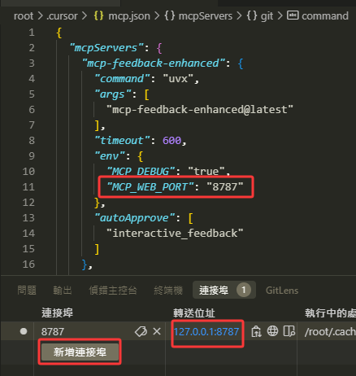
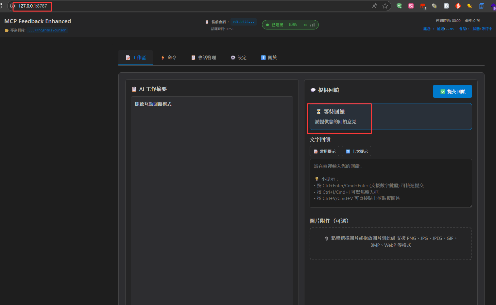

# SSH Remote 使用指南（v3.0 HTTP Daemon 模式）

> 已更新至 v3.0。舊的「等 MCP 自動打開瀏覽器」流程已廢棄——v3.0 改為
> 在遠端跑一個常駐 daemon，你用**本地**瀏覽器透過 SSH 端口轉發連進去。

## v3.0 模型變化

v2.x 每次 `interactive_feedback` 呼叫都會在 MCP 伺服器所在主機上嘗試
打開瀏覽器。SSH Remote（VS Code Remote / Cursor Remote / 等）遠端
沒有顯示環境，所以會報錯失敗。

v3.0 反轉了這個模型：

- 在遠端啟動**一個** daemon：`serve --http`；
- daemon 自己不再打開瀏覽器，只監聽端口；
- 你從**本地**瀏覽器透過 SSH 轉發的端口連進去（例如 `http://localhost:8765/`）；
- 所有 AI agent（Cursor Chat 等）向同一個 daemon URL 發 MCP 呼叫。

## 1. 在遠端啟動 daemon

根據你想用哪種轉發方式，綁定選項有兩種：

### 方案 A —— 綁定 localhost，用 SSH 轉發（推薦）

遠端執行：

```bash
# 前台執行，Ctrl+C 停止（在 clone 的倉庫目錄中執行）
uv run mcp-interactive-feedback serve --http
# 或
uv run python -m mcp_feedback_enhanced serve --http
```

預設綁定 `127.0.0.1:8765`，僅本機可存取，遠端網路看不到。

然後在本地做端口轉發（見 §2）。

### 方案 B —— 綁定所有網卡（僅在你控制網路時使用）

```bash
uv run mcp-interactive-feedback serve --http --host 0.0.0.0 --port 8765
```

會在所有網卡監聽。**僅當**遠端在防火牆後且端口不對公網開放時安全。
daemon 本身不做鑑權。

## 2. 本地端口轉發

### VS Code Remote SSH

1. `Ctrl/Cmd+Shift+P` → `Forward a Port`；
2. 輸入 `8765`；
3. 本地瀏覽器打開 `http://localhost:8765/`。




### Cursor Remote

1. 打開 Ports 面板（命令面板 → `Toggle Ports`）；
2. 添加 `8765` 的轉發規則；
3. 本地存取 `http://localhost:8765/`。

### 純 SSH 命令列

```bash
ssh -L 8765:127.0.0.1:8765 user@remote-host
# 然後本地瀏覽器：http://localhost:8765/
```

## 3. Agent 端 `mcp.json`

你的 AI agent（Cursor IDE）跑在**本地**，只要本地能存取 MCP 端點就行。
SSH 轉發之後：

```json
{
  "mcpServers": {
    "mcp-feedback-enhanced": {
      "url": "http://127.0.0.1:8765/mcp/",
      "autoApprove": ["interactive_feedback"]
    }
  }
}
```

URL 末尾 `/` 必須保留。

## 4. 首次可用性測試

```bash
# 在本地筆電上，SSH 轉發起來之後
curl http://localhost:8765/api/all-sessions
# → {"sessions":[]}
curl -s http://localhost:8765/ | head -n 5
# → HTML
```

兩條都通後，在 Cursor 裡發一條會觸發 `interactive_feedback` 的訊息。
`http://localhost:8765/` 的側欄應出現新卡片。

## 5. 常見問題

**Q：還需要設定 `MCP_WEB_HOST=0.0.0.0` 嗎？**
A：不需要。那是 v2.x 為解決「遠端自動打開的瀏覽器看不到本地」臨時
搞的環境變數。v3.0 如果真要綁所有網卡，直接 `serve --host 0.0.0.0`
（方案 B）。

**Q：daemon 報 `address already in use`。**
A：其他 `mcp-feedback-enhanced` 進程或別的服務佔著 8765。要麼停
（`lsof -i :8765` → 殺 PID），要麼 `--port 18765` 換端口並同步改
SSH 轉發。

**Q：agent 一直連本地 8765，但 daemon 在伺服器上——沒反應。**
A：SSH 端口轉發其實沒生效。回到 §2 重新檢查，先用
`curl http://localhost:8765/api/all-sessions` 從筆電驗證能通，再
發起 AI 呼叫。

**Q：SSH 斷開後 daemon 還能活著嗎？**
A：直接 `uv run ... serve --http` 是前台進程，Ctrl+C / SIGHUP 會把它殺掉。
要長期存活用 `tmux` / `screen` / `nohup`：

```bash
tmux new -d -s mcp-feedback 'uv run mcp-interactive-feedback serve --http'
```

v3.0 刻意不提供 LaunchAgent / systemd 範本（設計決議見
[multi-session-http-redesign.md §7.14](../../architecture/multi-session-http-redesign.md)）。

**Q：同一台遠端機上能否多個用戶共用一個 daemon？**
A：不推薦。會話列表會在所有存取者之間共享——隱私風險。每人起自己的
daemon，分配不同端口。

**Q：瀏覽器 console 偶爾顯示 WebSocket "disconnected"（網路抖動之後）。**
A：頁面會自動重連。若沒有，重新整理即可——會話狀態全部在伺服端，
`sessions_snapshot` 事件會重新同步。

---

**相關文檔**：
- [階段 2：HTTP Daemon 使用指南](../../architecture/phase2-http-daemon-usage.md)
- [階段 3：雙欄多會話 UI 使用指南](../../architecture/phase3-multi-session-ui-usage.md)
- [Cache 管理](../cache-management.md)
